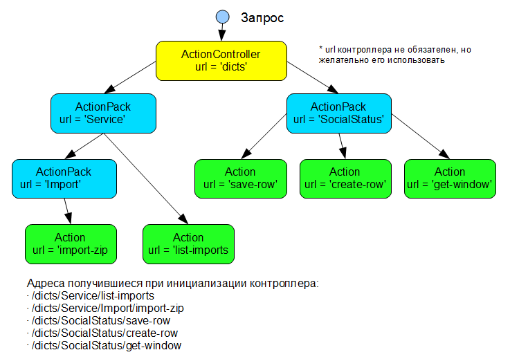

.. _actions_overview:

Экшены, паки и механизм обработки запросов М3
=============================================

Введение
--------

В Django все адреса запросов задаются с помощью регулярных выражений. Адреса могут быть сгруппированы по отдельным приложениям, но в итоге получается общий список всех выражений и соответсвующие им вьюшки. Он называется *urlpatterns*.

.. note::

	Вьюшка - это метод в Django принимающий HttpRequest и возвращающий HttpResponse. Как правило вьюшки находятся в модуле views.py приложения. `Writing views <http://docs.djangoproject.com/en/dev/topics/http/views/>`_

При поступлении запроса, он сначала проходит через все подключенные `Middleware <http://docs.djangoproject.com/en/dev/topics/http/middleware/>`_, затем проверяется на соответсвие выражениям из *urlpatterns*. В итоге либо вызывается соответсвующая вьюшка, либо генерируется исключение 404. Так вкратце работает механизм разруливания запросов в Django `URL dispatcher <http://docs.djangoproject.com/en/dev/topics/http/urls/>`_

Такой подход очень прост и вполне подходит для приложений уровня homepage ;) Но для корпоративных приложений появляются новые требования:

#. Отсутсвие вшитых в программу адресов (URL)
#. Изменение адресов на ходу
#. Перехват выполнения перед вьюшкой и после вьюшки
#. Автоматическое извлечение и контроль входных параметров вьюшки
#. Гибкое встраивание нового функционала

Концепция
---------

Чтобы покрыть недостающий функционал URL dispatcher было принято решение - отказаться от вьюшек и использовать их только как точки входа в приложение. Т.е. одно приложение - одна вьюшка, в которую приходят все запросы приложения. Далее будем называть её - *вьюшка контроллера*.

Вьюшки были заменены классами *Action* (экшены). Экшены аналогичные по смыслу и стремящиеся к одной цели, сгруппированы в классы *ActionPack* (экшенпаки). Таким образом экшены и паки представляют собой дерево, каждый узел которого имеет свой кусочек адреса. Путь от корня до конечного экшена является полным адресом, аналогичным адресу в URL dispatcher.

Связующим звеном между деревом экшенов и вьюшкой котроллера, является класс *ActionController*. Он хранит экшенпаки и отвечает за обработку запросов. Как правило контроллер бывает один на приложение.

Схема формирования адресов:

Диаграмма обработки запроса:

.. image:: images/actions/actions_seq_diagram.png
   :scale: 60 %

Самый первый запрос к вьюшке контроллера вызывает метод populate() в ControllerCache. Этот класс отвечает за хранение глобального списка контроллеров и начальную инициализацию дерева экшенов.

После первичного формирования дерева экшенов и контроллеров, запрос отправляется к конкретному котроллеру приложения. Получив сырой запрос, он разбирает его и проходит по дереву экшенов в поисках нужного. Если не находит, то генерирует исключение 404. Если находит то выполняет все встретившиеся на пути, от корня до экшена, методы pre_run(). Выполнив экшен, в обратном порядке выполняются все методы post_run(). Причем если хоть один из них вернул результат отличный от None, обработка прерывается и результат уходит наружу, во вьюшку контроллера.

.. _actions_Action::

Класс Action и его использование
--------------------------------

Пример экшена, который читает даннные из POST'а. Проверяет значение C и сохраняет в БД значения A и B. Код::
	
	from m3.ui.actions import Action
	from m3.ui.actions.results import OperationResult
	...
	
	class MyFirstAction(Action):
	    url = 'save'
	    verbose_name = u'Сохранение данных'
	    shortname = 'my-first-action-alias'
	    
	    def pre_run(self, request, context):
	    	""" pre_run удобно использовать для начальных проверок """
	    	value = request.POST.get('C')
	    	if value < 0:
	    	    # Обработка запроса на этом прерывается
	    	    return OperationResult(success=False, message=u'Недопустимое значение')
	    	    
	    def run(self, request, context):
	    	""" Основная работа экшена производится здесь """
	    	a = request.POST.get('A')
	    	a = request.POST.get('B')
	    	SomeModel.objects.create(a=a, b=b)
	    	return OperationResult(message=u'Данные сохранены')

Для чего нужен OperationResult будет описано в главе :ref:`actions_results`. Вкратце это один из возможных результатов работы экшена, который автоматически преобразуется в Django HttpResponse внутри контроллера. В нашем случае класс  *OperationResult* указывает успешно ли завершилась операция *success* и несет соответствующее сообщение *message*.

.. module:: m3.ui.actions

.. autoclass:: Action
   :members:

.. _actions_ActionPack::

Класс ActionPack и его использование
------------------------------------

Экшены и паки входящие внутрь нашего пака задаются с помощью атрибутов *actions* и *subpacks*. Пример::
	
	from m3.ui.actions import ActionPack
	
	class MyFormActionPack(ActionPack):
	    def __init__(self):
	    	super(MyFormActionPack, self).__init__()
	        self.actions.extend([
	            GetWindowAction, GetDataAction(), SaveAction, DeleteAction()
	        ])
	        self.subpacks.append( InnerActionPack )
	        
	class InnerActionPack(ActionPack):
	    url = 'inner'
	    def __init__(self):
	        super(InnerActionPack, self).__init__()
	        self.actions.extend([
	            SubAction1, SubAction2, ...  
	        ])

Обратите внимание, что в список *actions* можно добавлять как классы, так и экземпляры экшенов. На самом деле это не имеет значения, т.к. контроллер при инициализации автоматически создает экземпляры экшенов и паков, а также дополняет их специальными атрибутами. Об этом в главе :ref:`actions_ActionController`
	
Часто бывает необходимо получить прямой доступ к экшенам внутри пака через атрибуты. Живой пример из М3::

	class BaseDictionaryActions(ActionPack):
	    def __init__(self):
	        super(BaseDictionaryActions, self).__init__()
	        self.list_window_action   = DictListWindowAction()
	        self.select_window_action = DictSelectWindowAction()
	        self.edit_window_action   = DictEditWindowAction()
	        ...
	        self.actions = [
	            self.list_window_action, 
	            self.select_window_action, 
	            self.edit_window_action,
	            ...
	        ]
	
.. module:: m3.ui.actions

.. autoclass:: ActionPack
   :members:
   
.. _actions_ActionController:
   
Класс ActionController и его использование
------------------------------------------

Определение контроллера состоит из нескольких этапов:

#. Экземпляр контроллера как правило создается в файле *app_meta.py* внутри приложения. Подробнее о нем в главе :ref:`app_meta`.
#. Чтобы передавать в него запросы Django нужно создать вьюшку контроллера *dict_view* и зарегистрировать url pattern для неё в методе *register_urlpatterns*. Он вызывается автоматически для всех приложений.
#. Регистрация паков в контроллере производится методом *register_actions*.

Пример файла app_meta.py внутри приложения dicts::
	
	# Именованный экземпляр контроллера
	dict_controller = ActionController(url='/core-dicts', name=u'Справочники')
	
	def register_urlpatterns():
	    """ Регистрация вьюшки контроллера """
	    return urls.defaults.patterns('',
                (r'^core-dicts/', 'mis.core.dicts.app_meta.dict_view'),
            )

        def dict_view(request):
            """ Вьюшка контроллера """
            return dict_controller.process_request(request)
            
        def register_actions():
            """ Регистрация паков в контроллере """
            dict_controller.packs.extend([
                MyFormActionPack, 
                MyDictionaryActions
            ])

При добавлении пака в контроллер вызывается метод *_build_pack_node*, который создает экземпляр пака и всех вложенных в него экшенов и паков. Заполняются служебные атрибуты, с помощью которых можно обходить дерево:

* parent - ссылка на родительский пак
* controller - ссылка на родительский контроллер

Чаще всего бывает нужно найти экшен или пак в уже сформированной иерархии. Для этого есть несколько методов:

* По известному адресу экшен можно найти методом *get_action_by_url*
* Пак по имени или классу можно найти методом *find_pack*
* Рекомендуется искать экшены и паки по короткому имени (псевдониму). Для него есть атрибут shortname.

.. autofunction:: m3.helpers.urls.get_action

.. autofunction:: m3.helpers.urls.get_pack

Пример::
	
	from m3.helpers import urls
	
	my_action = urls.get_action('my-action-alias')
	my_pack = urls.get_pack('my-pack-alias')

.. autoclass:: ActionController
   :members: 

Типичные ошибки
---------------

Для облегчения отладки при работе с экшенами созданы собственные исключения.

.. autoexception:: ActionException
   :members:
   
.. autoexception:: ActionNotFoundException
   :members:

.. autoexception:: ActionPackNotFoundException
   :members:

.. autoexception:: ReinitException
   :members:

.. autoexception:: ActionUrlIsNotDefined
   :members:   
   
Изменения структуры паков на ходу (обёртка)
-------------------------------------------

Этим лучше не пользоваться ;)
