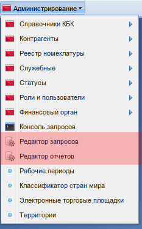

.. m3_query_builder:

Редактор запросов и отчетов (m3_query_bilder)
===========================

Данное приложение предназначено для создания произвольных отчетов, которое может
отображать произвольный набор данных. Поддержка группировок, сортировок и условий,
как на уровне конечного пользователя, так и на уровне создания запроса.

Содержит в себе редактор запросов и редактор отчетов.

Редактор запросов
-----------------

Позволяет динамически строить sql запрос с помощью веб-интерфейса