.. m3_query_builder:

Редактор запросов и отчетов (m3_query_bilder)
===========================

Данное приложение предназначено для создания произвольных отчетов, которое может
отображать произвольный набор данных. Поддержка группировок, сортировок и условий,
как на уровне конечного пользователя, так и на уровне создания запроса.

Содержит в себе редактор запросов и редактор отчетов.

.. image:: ../images/contrib/m3_query_builder/menu.png    

Редактор запросов
-----------------

Позволяет динамически строить sql запрос с помощью веб-интерфейса. 
Попробуем создать запрос и на основе его создать произвольный отчет.

Щелкаем в меню на Редакторе запросов, таким образом открывается линейный
справочник, который содержит сохранненые запросы. Нажимаем кнопку "*Добавить*".
Открывается окно нового запроса: 

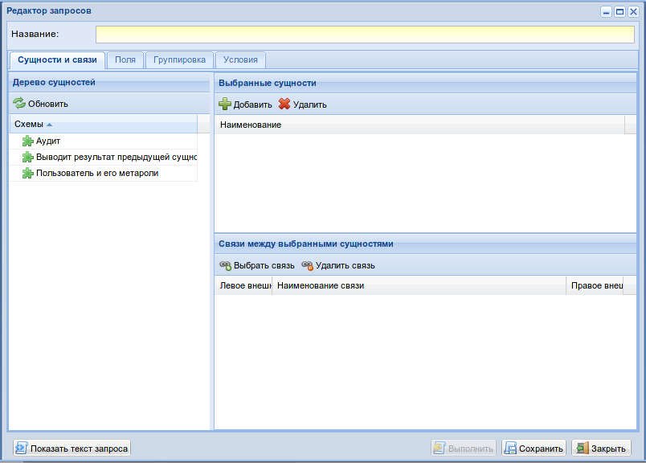

Вкладка "Сущности и связи":
"""""""""""""""""""""""""""

Слева должны находиться имеющиеся схемы (сущности) в проекте. Правила добавления
описаны в подразделе :ref:`add-entity-rules`.

Выбираем сущность "*Аудит*" и "*Пользователи и его метароли*" и переносим их в выбранные
сущности. Это и все операции переноса и добавление поддерживают Drag & Drop.

После чего можно выбрать связь между сущностями щелкнув на кнопку "*Выбрать связь*".

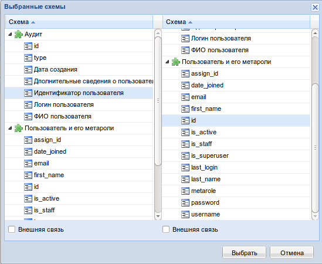

Флагом внешняя связь помечается сущность, если необходимо указать тип соединения 
(``inner join`` - если флагов нет, ``left join`` - если имеется один флаг на любой сущности, 
``full join`` - если два).

Добавим название к запросу: "*Информация о действиях пользователя*".

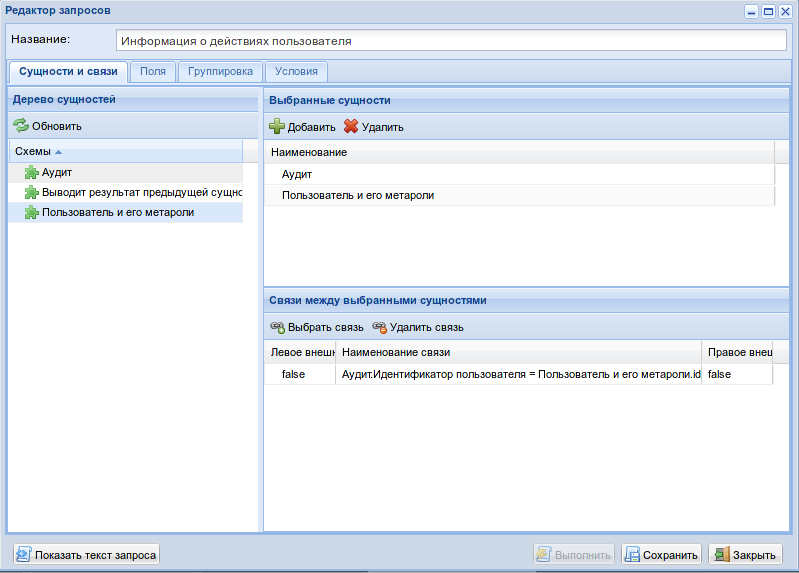

Вкладка - "Поля":
"""""""""""""""""""""""""""

На этой вкладке должны быть выбраны поля из выбранных ранее на первой вкладки сущностей.
Эти поля будут отображаться в select'e запроса. Так же имеется возможность задать сортировку
каждому полю по возврастанию, либо по убыванию.
Флаг "*Различные*" указывает на то, то будет использоваться ключевое слово ``DISTINCT``.
Флаг "*Количество записей*" с числом указывает на то, что будет использоваться ключевое слово ``LIMIT``.

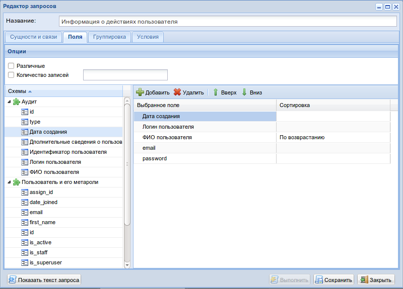

Вкладка "Группировка":
"""""""""""""""""""""""""""

На этой вкладке могут быть выбраны поля для группировки и агрегирования.

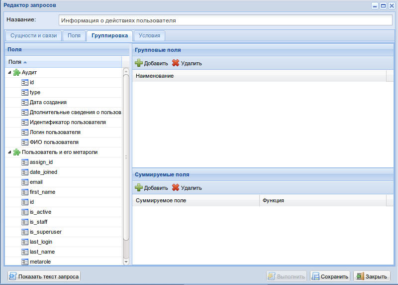

Вкладка "Условия":
"""""""""""""""""""""""""""

На этой вкладке могут быть выбраны условия в запросе:

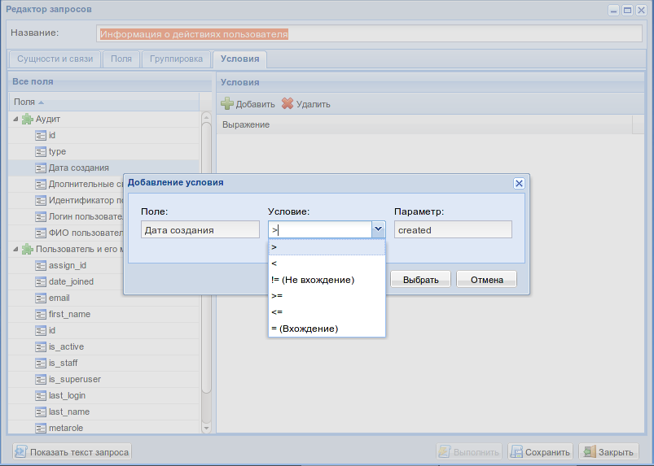

После чего можно посмотреть на SQL представление запроса щелкнув на кнопку 
"Показать текст запроса".

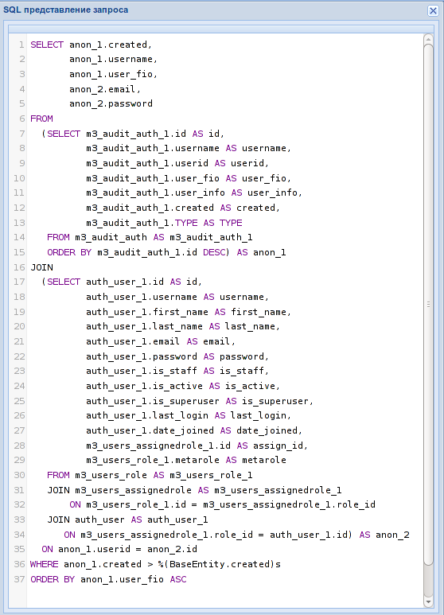

Для форматированного вывода необходимо установить пакет ``sqlparse`` из pip::

$sudo pip install sqlparse

Быть может его потом включим в *m3/vendor*

Нажимаем "*Сохранить*" и убеждаемся, что запрос успешно сохранен.
Следующим шагом создадим отчет и привяжем его к вновь созданному запросу.

Редактор запросов
-----------------

Открываем в меню "*Администрирование*" редактор отчетов, в списке имеющихся отчетов 
нажимаем "*Добавить*". Появляется форма создания отчета:

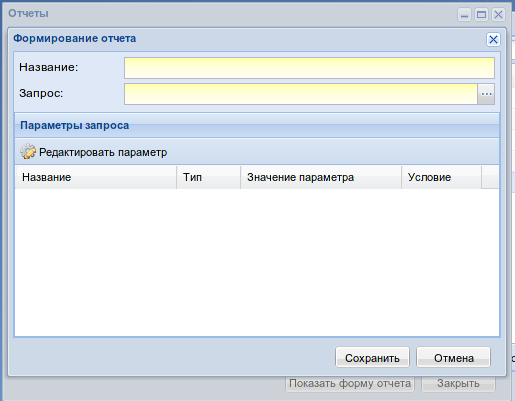

В поле "*Запрос*" выбираем вновь созданный запрос, причем параметры условия должны автоматически 
отобразиться в таблице. Указываем название отчета и по двойному клику редактируем 
условие в запросе:

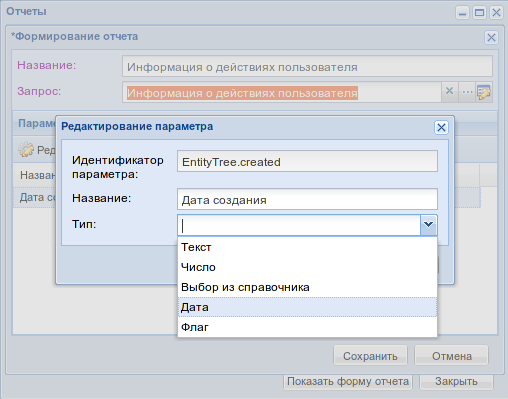

Задаем название, если оно в латинице (то есть не используется ``verbose_name`` в моделях).
И указываем какому типу соответствует выбранный параметр, для автаматической 
генерации формы отчета. Сохраняем полученное, видим свежесозданный отчет в списке, выбираем его и кликаем
на кнопку "*Показать форму отчета*".

.. image:: ../images/contrib/m3_query_builder/report-form.png

Выбираем дату (если не выбрать, условие будет не подставляться в запрос, таким образом 
будут выбранны все данные). Слева можем наблюдать в информации параметры сортировки,
группировки, условия и количество отображаемых данных в отчете. 
Нажимем "*Сформировать*". 

Открывается форма отчета:

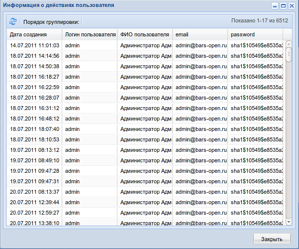

По любой колонке работает пользовательская группировка и сортировка:

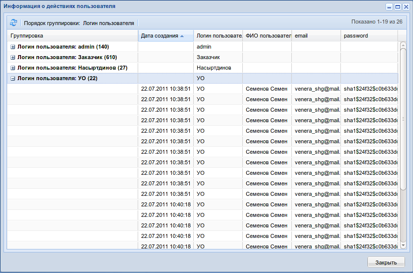

.. _add-entity-rules:

Добавление сущностей
------------------------------

Далее под понятием "*сущность*" будет подразумеваться некий объект, который
может быть моделью в джанговском представлении, либо объект, который реализует 
определенный интерфейс ``BaseEntity``. 

В приложении необходимо создать файл с названием ``schema.py``, в котором необходимо описать 
имеющиеся в этом приложении сущности, например сущности "*Аудит*" и 
"*Пользователи и метароли*" описываются следующим образом::

	class EntityOne(BaseEntity):
	    '''
	    Пользователь и его метароли
	    '''
	    def __init__(self):
	        super(EntityOne, self).__init__()
	
	        # Константные объекты для упрощенного доступа внутри сущности
	        class Data(object):
	            # Модель ролей
	            USER_ROLE = Model('m3_users.UserRole')
	            
	            # Модель связей ролей и пользователей
	            ASSIGNED_ROLE = Model('m3_users.AssignedRole')
	            
	            # Модель пользователей
	            USER = Model('auth.User')
	
	        # Название сущности - то, как она будет называться в редакторе запросов
	        self.name = u'Пользователь и его метароли'
	
	        # Список сущностей, который будет использоваться 
	        self.entities = [
	            Data.USER_ROLE,
	            Data.ASSIGNED_ROLE,
	            Data.USER,
	        ]
	
	        # Список связей между сущностями
	        self.relations = [
	            Relation( Field(Data.USER_ROLE, 'id'), Field(Data.ASSIGNED_ROLE, 'role') ),
	            Relation( Field(Data.ASSIGNED_ROLE, 'user'), Field(Data.USER, 'id') ),
	        ]
	
	        # Можно не указывать
	        self.group_by = []
	
                # Описание условия могло бы выглядеть вот так:
                # self.where = Where(Field(Data.ASSIGNED_ROLE, 'id'), 
                #					 Where.NE, 
                #					 Param(name='param1', 
                #						type=Param.NUMBER, 
                #						verbose_name=u'Идентификатор параметра')
                #				) & Where(Field(Data.USER, 'username'), 
                #						Where.EQ, 
                #						Param(name='param2', 
                #							type=Param.STRING, 
                #							verbose_name=u'ФИО пользователя') )
			
                # Описание сортировки могло бы выглядеть вот так:
                #self.order_by = [SortOrder(Field(Data.USER, 'username'), SortOrder.ASC)]
	
	        # Список полей, которые будут использоваться в выводе данных
	        self.select = [
	            Field(Data.USER, Field.ALL_FIELDS),
	            Field(Data.ASSIGNED_ROLE, 'id',  alias='assign_id'),
	            Field(Data.USER_ROLE, 'metarole'),
	        ]
	
	        # Использовать ли признак DISTINCT
	        self.distinct = None
	        
	class EntityTree(BaseEntity):
	    '''
	    Аудит
	    '''
	    def __init__(self):
	        super(EntityTree, self).__init__()
	
	        class Data(object):
	            AUDIT = Model('m3_audit.AuthAuditModel')
	
	        self.name = u'Аудит'
	
	        self.entities = [
	            Data.AUDIT,        
	        ]
	
	        self.relations = []
	
	        self.group_by = []
	
	        self.where = None
	
	        self.order_by = [SortOrder(Field(Data.AUDIT, field_name='id'), SortOrder.DESC)]
	
	        self.select = [
	            Field(Data.AUDIT, Field.ALL_FIELDS),        
	        ]
	
	        self.distinct = None
	        
Обязательное условие - описываемые классы должны наследоваться от ``BaseEntity`` и 
должны декларативно описывать свои возможности.

Разберем возможности более подробно:

.. module:: m3.contrib.m3_query_builder.entity

* Класс ``Data``: 
 * Нужен для более легкого доступа к сущностям модели, то есть чтобы 
   везде не писать ``Model('m3_audit.AuthAuditModel')``, можно использовать 
   ``Data.AUDIT``
 
 * ``Model('m3_audit.AuthAuditModel')`` - ``Model`` в контекте *django* говорит о том, что используется 
   модель, так же есть возможность использовать ``Entity``
	  
   .. autoclass:: Model
   
   .. autoclass:: Entity
   
* Атрибут ``name``:
  Название сущности
  
* Атрибут ``entities``:
  Список возможных сущностей, которые включают в себя данные из ``Data``, пример::    
   self.entities = [
      Data.USER_ROLE,
      Data.ASSIGNED_ROLE,
      Data.USER,
   ]

* Атрибут ``relations``:
  Список связей между сущностями
  
  Пример::    
    self.relations = [
        Relation( Field(Data.USER_ROLE, 'id'), Field(Data.ASSIGNED_ROLE, 'role') ),
        Relation( Field(Data.ASSIGNED_ROLE, 'user'), Field(Data.USER, 'id') ),
    ]

* Атрибут ``group_by``:
  Список полей для сортировки

* Атрибут ``order_by``:
  Список полей для группировки

* Атрибут ``select``:
  Список результирующих полей, которые будут отображаться в готовом отчете

* Атрибут ``where``:
  Список условий

* Атрибут ``distinct``:
  ``True`` или ``False`` - Добавляет ключевое слово ``DISTINCT`` в запрос.
  Пример::
    self.distinct = False
  
* Атрибут ``limit``:
  Добавляет количество отобранных записей. Пример::
    self.limit = 100 # Будут возвращены 100 записей