.. _excel_reporting:

Устаревший генератор отчетов в Excel (m3.core.excel_reporting) 
===================================================

ВАЖНО!
------
В данный момент акутуальной системой по генерации отчетов считается :doc:`../simple_report`

Введение
--------

Основным критерием при создания системы отчетности являлось легкое изменение шаблонов и создание новых шаблонов. Microsoft Excel является форматом де-факто документооборота в России. Из-за своей широкой распространенности Excel'ем умеет пользоваться "всякая бухгалтерша". Так-же Excel можно условно назвать кроссплатформенным, т.к. его могут открывать не только программы работающие на MS Windows. Linux клиенты могут просматривать отчеты например в OpenOffice или IBM Lotus Symphony.

Возможности
-----------

#. Подстановка строк, чисел и дат в ячейки с сохранение форматирования и стиля
#. Подстановка нескольких значений в ячейку
#. Вертикальная развертка строк, в том числе вложенная, с подстановкой значений 
#. Горизонтальная развертка строк с подстановкой значений
#. Проецирование матрицы со значениями на область
#. Поддержка смежных областей, в том числе задание их тегами
#. Поддержка общих строк для каждого листа и авто-высоты для строк
#. Изменения стиля ячейки по условию (пока самое простое)
#. Обработка всех листов в книге
#. Перенос некоторых параметров печати

Принцип работы
--------------

Движок генератора написан на J2SE с использованием библиотеки `Apache POI <http://poi.apache.org/>`_. Более вменяемого и бесплатного средства для работы с Excel на момент разработки не нашлось. Поэтому, при использовании генератора в системе требуется наличие `JRE <http://www.oracle.com/technetwork/java/javase/downloads/index.html>`_ версии не 1.6 и новее. 

Формирование отчета заключается в сборке данных, их сериализации, добавлении дополнительных настроечных параметров и отправке в java-часть генератора. Производится выполнение jar-файла и обмен данными между ним и Python'ом через STDIN/STDOUT и внешние файлы. Настройки не требуется, скомпилированный jar файл и необходимые файлы Apache POI лежат внутри пакета и запускается автоматически.

Исходным материалом является шаблон в формате Excel-97 (xls) со специальными тегами внутри. Этот шаблон открывается и сериализованные данные расставляются в соответствии с тегами в документе. Далее сохраняется новый файл, шаблон остается неизменным. Пользователю не нужно самому заниматься сериализаций, достаточно предоставить правильно сформированный объект.

Теги представляют собой текст, экранированный специальными символами, в самих ячейках или их комментариях. Теги регистронезависимы для генератора, но их дополнительные параметры зависимы. Теги удаляются из листа после формирования отчета.

Для работы с генератором нужно всего лишь импортировать модуль::
	
	import m3.core.excel_reporting.report_gen
	
Есть 2 фундаментальных метода, с помощью которых работает весь python-код генератора:

.. module:: m3.core.excel_reporting.report_gen

.. autofunction:: make_report_from_object

.. autofunction:: make_report_from_json_string

Базовый класс для отчетов.
--------------------------

Самым удобным способом создания новых отчетов является определение их как классов. В платформе M3 для этого служит класс BaseReport.

.. autoclass:: BaseReport
   :members:

Пример использования::
	
	class TestReport(BaseReport):
	    template_name = "report\\excel\\test.xls" 
	    result_name = "report\\excel\\OUT.xls" 

	    def collect(self):
		result = {}
		# Получаем данные тут
		......
		
		return result

	def test():
	    rep = TestReport()
	    rep.make_report();
	    
Структура объекта данных
------------------------

Структура объекта проектировалась таким образом, чтобы обеспечить максимальную совместимость со штатным движком шаблонов Django и легко использоваться в HTML шаблонах. Он представляет собой словарь, в который в виде значений могут быть вложены другие словари и списки.

Пример структуры объекта::

	{"name": "валюты",
	 "TEMPLATE_FILE_PATH": "d:\\_DEV\\workspace\\JavaReport\\media\\test.xls",
	 "OUTPUT_FILE_PATH": "d:\\_DEV\\workspace\\JavaReport\\media\\OUT.xls",
	 
	 "Число": 13,
	 "Булево": "true",
	 "ФИО": "Иванов Иван Иваныч",
	 "Дата": "21.12.1990",
	  
	 "М3Дата": "#m3dd#21.12.1920",
	 "М3Время": "#m3tt#21:12:33",
	 "М3ДатаВремя": "#m3dt#21.12.1990 21:12:33",
	  
	 "currency": [{
	    "name": "RUB",
	    "value": 1.00},
	    {
	    "name": "USR",
	    "value": 30},
	    {
	    "name": "EUR",
	    "value": 40}],
	
	 "country": [{
	    "name": "Россия",
	    "city": [{
		"name": "Москва",
		"street": [{
		    "name": "Ямская"},
		    {
		    "name": "Тверская"}]},
	
		{
		"name": "Казань",
		"street": [{
		    "name": "Ферма-2"},
		    {
		    "name": "Баумана"}]
		}]
	    },
	
	    {
	    "name": "Америка",
	    "city": [{
		"name": "Вашингтон",
		"street": [{
		    "name": "Валли стрит" 
		    }]
		}]
	    }]
	}

На примере мы видим одиночную таблицу currency, содержащую 3 строки. И 2 вложенных таблицы: street вложена в city, city вложена country.
*TEMPLATE_FILE_PATH* и *OUTPUT_FILE_PATH* - это зарезервированные имена параметров, которые добавляются генератором автоматически. Определяют путь к исходному шаблону и путь к результирующему файлу.

`JSON <http://www.json.org/>`_ поддерживает только примитивные типы данных, к таким не относятся дата и время. В Python они представлены отдельными классами datetime, date и time. Для их сериализации используется специальный класс ReportJSONEncoder. Он добавляет в строковому представлению даты и времени префикс #m3dt#, #m3dd# и прочие, для того, чтобы на java-стороне можно было правильно понять их их. 

Приоритет операций
------------------

Чтобы лучше понимать показанные в дальнейшем примеры, нужно знать в какой последовательности выполняются операции при генерации отчета:

#. Горизонтальная развертка с подстановкой
#. Вертикальная развертка
#. Подстановка значений в строках 
#. Проецирование матрицы
#. Наложение повторяющихся строк
#. Наложение смежных регионов

Подстановка значений в ячейки
-----------------------------

Для подстановки значения в ячейку используется тег **$ИмяПеременной$**. Знак *$* дает понять, что в этом месте нужно подставить значение переменной из JSON контекста с именем *ИмяПеременной*.

В случае с простыми типами этого достаточно. Но если нужно подставить дату, время или представить число в отформатированном виде, то в свойствах ячейки нужно заранее установить нужный формат и стиль.

Примеры подстановки:

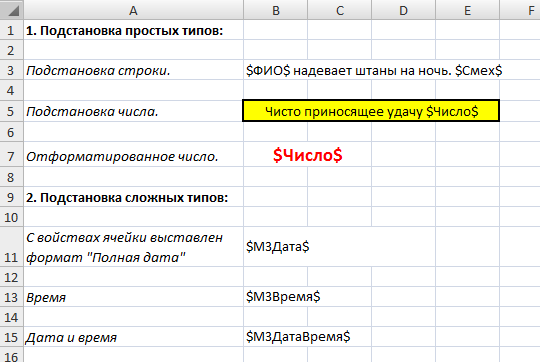

Результат

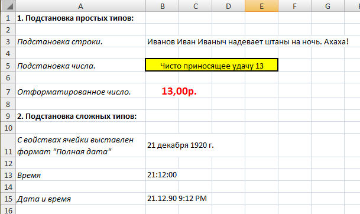

Вертикальная развертка
----------------------

Вертикальная развертка задается открывающим тегом **#ИмяРегиона** и закрывающим **##ИмяРегиона**. Представляет собой копирование региона, состоящего из одной или нескольких строк Excel. Копируется он столько раз, сколько элементов в списке его представляющем. После теги # и ## больше не нужны и удаляются генератором.

Развертка приоритетнее чем подстановка. Поэтому теги подстановки копируются и обрабатываются после подстановки. Это позволяет легко строить таблицы с заведомо известным количеством колонок.

Пример данных для развертки::
	
	{"name": "курсы валют по отношению к рублю", 
	 "currency": [{
	     "name": "JPY",
	     "value": 35.99},
	     {
	     "name": "USR",
	     "value": 30.12},
	     {
	     "name": "EUR",
	     "value": 40.4}]
	}

Пример развертки:
	
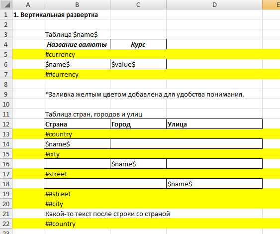

Как видно из примера, регион *currency* состоит из одной строки. В JSON данных currency представляет из себя список из 3-х словарей. Следовательно строка будет скопирована 3 раза. Далее в строки будут подставлены значения из словаря с соответствующим номером в списке. Первой строке первый словарь, второй строке - второй словарь и т.д. Т.е. контекст строки изменяется в зависимости от вложенности развертки и номера строки.

На следующем примере показано как работают вложенные регионы. Регион *country* включает в себя регионы *city* и *street*. Причем внутри региона может находится что угодно, в нашем случае это дополнительная строка.

Результат:

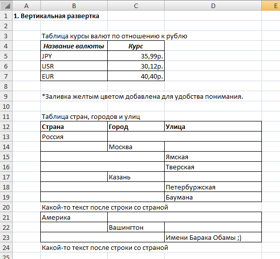

	
Горизонтальная развертка
------------------------

Горизонтальная развертка работает аналогично вертикальной, но копируются не строки, а прямоугольные регионы (не колонки). Задается развертка тегами **%ИмяРегиона Ширина** и **%%ИмяРегиона Ширина**. Где *ИмяРегиона* - переменная в контексте, а *Ширина* - ширина копируемого региона. Прямоугольный регион начинается со строки с тегом *%*, заканчивается строкой *%%* и имеет ширину в правую сторону *Ширина*.

Подстановка в копируемом регионе тоже отличается. Вместе с именем переменной нужно указвать имя региона с точкой. Например, вместо $Год$ писать $Годы.Год$.

Ширина колонок не копируется, потому что сверху и снизу могут находится другие таблицы и их внешний вид может нарушиться.

Пример данных::
	
	"Годы": [
	    {"Год": 2010, "Культура": "Пшеница", "Урожай": 500},
	    {"Год": 2011, "Культура": "Рожь", "Урожай": 600},
	    {"Год": 2012, "Культура": "Горох", "Урожай": 700},
	    {"Год": 2013, "Культура": "Соя", "Урожай": 800}
	],

Пример:

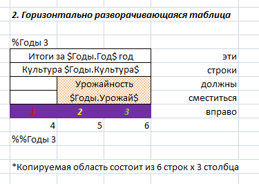

Результат:

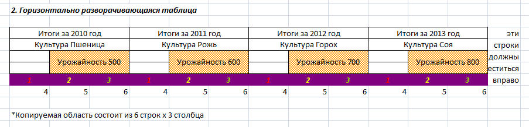

Как показала практика, горизонтальная развертка плохо подходит для создания таблиц с неизвестным количеством колонок. Только для построения шапки таблицы.

Проецирование матрицы
---------------------

Наиболее простым и мощным способом создания таблиц заранее неизвестного размера, является проецирование прямоугольной матрицы значений непосредственно на ячейки в листе. Проецирование начинается от заданной ячейки (её координаты) и до тех пор пока позволяет размерность матрицы.

Задается матрица тегом **#Матрица ИмяПеременной** в комментарии к ячейке.

Пример данных::
	
	"ЛПУ": [
	    {"name": "Центральная поликлиника"},
	    {"name": "Детская больница"},
	    {"name": "Родильные дом"}
        ],
        "МоиДанные": [
	    ["ЛПУ1", 1000, 2000, 3000, 9],
	    ["ЛПУ2", 4000, 5000, 6000, 99],
	    ["ЛПУ3", 7000, 8000, 9000, 999]
        ],

Обратите внимание, что вместо словарей в списке *МоиДанные* находятся списки. Это связано с тем, адресация идет не по ключу, как при подстановке, а по номеру колонки.

Список *ЛПУ* не отобразился в результирующем файл, он мог быть вообще пустым. Он был нужен лишь для вертикальной развертки таблицы, проще говоря чтобы появились рамки. Данные все равно взялись из матрицы. См. пункт *приоритет операций*.
        
Пример шаблона:

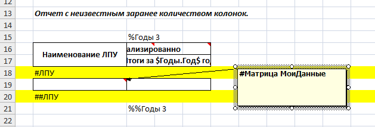

Как видно из примера, в строке региона *ЛПУ* нет тегов подстановки *$*, зато есть матрица в комментарии. Горизонтальная развертка используется только для формирования шапки.

Результат:

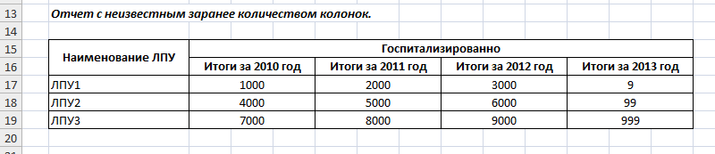

Автовысота
----------

Для того чтобы Excel сам определял высоту ячейки нужно использовать тег **#Автовысота** в комментарии к ячейке и следовать правилам: 

* Ни в коем случае нельзя трогать руками высоту строки или пытаться обнулить ее. Лучше вставить новую строку. Иначе в Excel-файл сохраняется фиксированная высота и тег не будет работать.
* В свойствах ячейки нужно включить перенос по словам.
* Высота определяется в строке в момент открытия в Microsoft Office или Open Office, и может визуально отличаться. Внутри Apache POI её тоже точно определить нельзя. Связано это с тем, что все они используют разные библиотеки для рендеринга шрифтов.

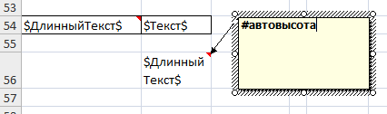

Форматирование по условию
-------------------------

Можно изменять цвет и стиль шрифта в ячейке в зависимости от значения переменной контекта. Пока поддержиается крайне ограниченный набор изменений и из условий только равенство.

Условие задается в комментарии к ячейке тегом **#ЕСЛИ Условие ТО СписокИзменений**.

Пример::
	
	#ЕСЛИ Число=10 ТО ШРИФТ:ЖИРНЫЙ, ЦВЕТ: КРАСНЫЙ, ШРИФТ: ПОДЧЕРКНУТЫЙ

	#ЕСЛИ Булево=true ТО ШРИФТ:ЖИРНЫЙ, ШРИФТ:ЗАЧЕРКНУТЫЙ
	
Поддерживаемые стили директивы *ШРИФТ*: ЖИРНЫЙ, ПОДЧЕРКНУТЫЙ, ЗАЧЕРКНУТЫЙ.

Поддерживаемые цвета директивы *ЦВЕТ*: КРАСНЫЙ, ЗЕЛЕНЫЙ, ЖЕЛТЫЙ, ЧЕРНЫЙ, СИНИЙ. Недостающие можно легко добавить в пределах палитры Office 97.

Смежные регионы
---------------

Генератор полностью копирует все смежные регионы из листов шаблона в листы результирующего файла. Также смежные регионы копируются при развертках. Но иногда этого бывает недостаточно и тогда помощь приходит тег **#Объединить НомерОбласти**.

Принцип работы прост. При обработке листа собираются все теги *#Объединить* и группируются по номеру области. Таким образом используя разные номера можно задавать несколько списков тегов, формирующих разные смежные области. 

Далее координаты ячеек из списка тегов объединяются в прямоугольники, которые и являются созданными смежными областями. Например, у нас есть 3 ячейки с координатами (3,4), (5,6), (1,2) - их область будет иметь координаты (1,2)-(5,6).

Пример:

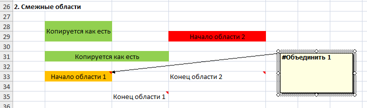

Как видно из примера, смежная область получает такие же свойства как у самой верхней левой ячейки области.

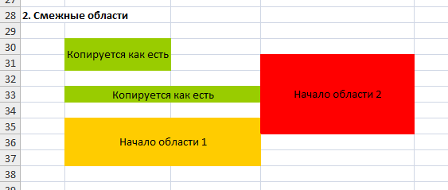

Повторение строк для каждого листа
----------------------------------

Часто бывает нужно распечатать длинные таблицы, не помещающиеся на один лист. Чтобы их шапка отображалась на каждом листе, нужно пометить крайние левые ячейки строк шапки тегом **#Автовысота** в комментарии.
