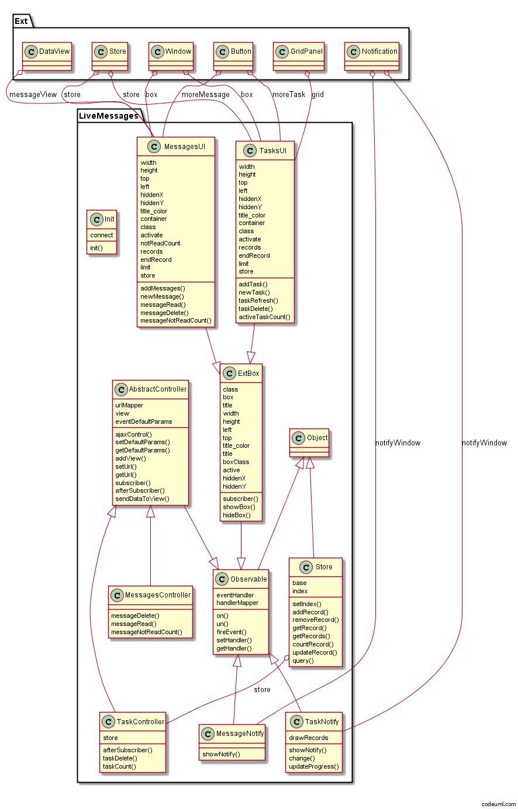
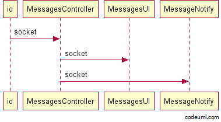
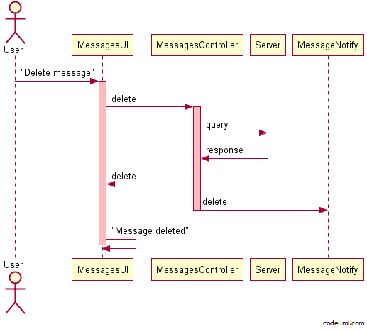

.. _client:

**********************************
Подробное описание клиента
**********************************

Общий обзор
===========

*LiveMessages.Observable* - Родительский класс обеспечивающий работу механизма событий.

*LiveMessages.AbstractController* - абстрактный контроллер приложения, является "прослойкой" между сервером и представлением.

*LiveMessages.ExtBox* - Абстрактный класс для мини окон, предоставляющий API для возможности запустить обработчик события и содержит в себе много мемберов которых можно не описывать в классах наследниках.

*LiveMessages.Store* - Хранилище, можно добавлять, изменять, удалять, искать данные по столбцу.

*LiveMessages.MessagesController* - расширяет *LiveMessages.AbstractController* возможностями для работы с Сообщениями.

*LiveMessages.TaskController* - расширяет *LiveMessages.AbstractController* возможностями для работы с Задачами.

*LiveMessages.MessagesUI* - мини окно для вывода списка сообщений. Предоставляет пользователю возможность удалять, отмечать прочитанные сообщения.

*LiveMessages.TasksUI* - мини окно для вывода списка задач. Предоставляет пользователю возможность удалять, наблюдать за прогрессом статуса задач.

*LiveMessages.MessageNotify* - Обертка для всплывающего сообщения. Выводит текст сообщения.

*LiveMessages.TaskNotify* - Обертка для всплывающего сообщения. Выводит прогрессбар и статус сообщения.

*LiveMessages.Init* - точка входа в приложение, инициализация всех контроллеров и подписка их на получение сообщений от сервера через `Socket.IO <http://socket.io/>`_

По умолчанию в LiveMessages на WebSocket соединение вешаются обработчики на событие socket.
Для ajax запросов в контроллерах прописываются урлы, либо задаются при инициализации.

Механизм работы сообщений и задач.
==========================

Реакция контроллера Сообщений на событие socket:

Эта схема описывает что происходит при инициировании сервером передачи сообщения в реальном времени.
WebSocket уведомляет контроллер, о том что возникло событие socket и вторым параметром передает полученные данные, затем контроллер уведомлет каждую вьюшку.
Вьюшка мини окна добавляет полученное сообщение в хранилище store и выводит ее пользователю, о рендеринге данных средствами extjs можно получить на `оф.сайте <http://docs.sencha.com/ext-js/3-4/>`_
Всплывающее уведомление выводит полученное сообщение.

Пользователь нажал кнопку на удаление сообщения, (событие delete):

.. note::
    Ajax запрос возникает только в том случае, если заранее в контроллере был навешан обработчик запроса на это событие.

На схеме видно, что вьюшка отреагировала на просьбу пользователя и запустила у себя событие delete с параметром id сообщений.
Так как контроллер навесил свой обработчик на событие delete вьюшки, дергается этот обработчик и передается туда id сообщения.
Контроллер просит у сервера удалить это сообщение, если ответ сервером успешный, то дергается событие delete у всех вьюшек и передается ответ.
Если вьюшки имеют обработчики этого события, то они отреагируют.

Если необходимо внести изменения в систему, например добавить новый функционал, можно создать экзмепляр класса и расширить этот класс своими методами и изменить шаблон представления.
Добавление нового функционала::

    var NewController = LiveMessages.extend(LiveMessages.MessagesController, {

        init: function (settings) {
            var self = this;

            // Обязяательно! нужно вызвать родительский init для передачи настроек и для унаследования от родителя всех свойств.
            LiveMessages.MessagesController.prototype.init.call(this, settings);

            // Установка параметров запроса по умолчанию.
            this.setDefaultParams('newEvent', {
                id: null,
                param: 'any'
            });

            // Установка обработчика, ее можно получить через getHandler();
            this.setHandler('newEvent', this.newMethod);

            // Установка обработчика события.
            this.on('newEvent', function (id, param) {
                self.ajaxControl('newEvent', {id: id, param: param});
            });

            // Навешивается обработчик на события всех вьюшек.
            this.onViewsEvent('newEvent', function (id, param) {
                self.fireEvent('newEvent', id, param);
            });

        },

        newMethod: function (event, response, id) {
            // Какие-то манипуляции с полученными данными
            this.sendDataToView(event, response, id);
        }
    });

Таким образом создается экземпляр контроллера и расширяется новым методом. При инициализации этого контроллера произойдут регистрации обработчиков, и навешивания на события вьюшек всех необходимых обработчиков.

Сообщения и Задачи также разработаны аналогичным образом, единственное изменение в шаблоне вывода задач и в реализациях их методов.