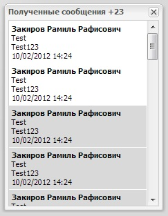

**********************************
Подробное описание клиента
**********************************

Клиентская часть разрабатывалась с такой целью чтобы можно было использовать LiveMessages с разными JavaScript библиотеками.

Пространство имен приложения живых сообщений называется **LiveMessages**.

Общий обзор
===========

**LiveMessages.AjaxWrapper** - Обертка для механизма аякс запросов, мы можем использовать внутри обертки любую библиоткеку для запросов на сервер.
**LiveMessages.Controller** - точка входа приложения, Инициализация всех контроллеров и подписка их на получение данных от сервера через Socket.IO
**LiveMessages.AbstractController** - абстрактный контроллер приложения, в котором есть общие механизмы:

- **ajaxControl** отправка ajax при возникновении события.
- **handler** обработчик получаемого сообщения от сервера.
- **sendDataToView** механизм передачи данных во вьюшки. Передает имя события и аргумент даты. Соответсвенно вьюшка сама решает как реагировать на это событие и обработать данные.
- **afterHandler** вызывается после **handler** и передается туда массив полученных сообщений.

**LiveMessages.ExtBox** - абстрактный класс для миниокон, реализован на ExtJs. имеет общие реализации:

- **handler** обработка передаваемых данных контролером, наличие этого метода обязательна, т.к. она предоставляет API для контроллера!
- **showBox** раскрыть миниокно.
- **hideBox** скрыть миниокно.

**LiveMessages.Observable** - общий класс для удобной реализации навешивания обработчиков событий, от нее наследуются все абстрактные классы.

- **on** метод которым можно навесить обработчик
- **fireEvent** метод которым можно вызвать обработчик.

Пример разработки модуля
========================

Для разработки модуля Живых сообщений, можно унаследовать от абстрактного класса **LiveMessages.AbstractController** все методы и поля.
Назовем пример модуля именем Messages, контроллер этого модуля **LiveMessages.MessagesController** и вьюшка будет называться **LiveMessages.MessagesUI**.
Создадим папку messages и два файла в нем с именами **controller.js** и **ui.js**

Соотвествено в **controller.js** будет описан скрипт контроллера, а в **ui.js** скрипт представления.

Произведем наследование от абстрактного класса::

    LiveMessages.MessagesController = LiveMessages.extend(LiveMessages.AbstractController, {
        init: function (settings) {
            LiveMessages.AbstractController.prototype.init.call(this, settings);
            // Обязательно нужно вызвать конструктор родителя чтобы получить все поля и свойства и необходимую инициализацию класса.
        }
    });

Реализуем обработчики успешных ответов от сервера::

    // Обработчик события удаления сообщения
    messageDelete: function (event, response, id) {
        if (response['success']) {
            this.sendDataToView(event, id);
        }
    }

    // Обработчик события чтения сообщения.
    messageRead: function (event, response, id) {
        if (response['success']) {
            this.sendDataToView(event, id);
        }
    }

    // Передается во вьюхи информация о непрочитанных сообщениях.
    messageNotReadCount: function (event, response) {
        this.sendDataToView(event, response['count']);
    }

.. note::
    Это нужно для того чтобы контроллер знал как обработать поступившие данные и передать их во вьюху.

Чтобы механизм Ajax запроса знал по какому пути выполнять запрос при конкретных событиях, необходимо прописать карту запроса::

    urlMapper: {
        'delete'       : "/roles/messages/delete",
        'query'        : "/roles/messages/all",
        'read'         : "/roles/messages/read",
        'countNotRead' : "/roles/messages/count-not-read"
    }

Так как механизм Ajax запроса единственный на все приложение, она принимает аргументами имя события и дополнительные аргументы влияющие на запрос.
Чтобы при успешном запросе, механизм мог понять при каком событии какой обработчик вызывать, необходимо прописать в **_handlerMapper** соответствующий обработчик на соответсвующее событие::

    this._handlerMapper = {
        'delete'       : this.messageDelete,
        'query'        : this.handler,
        'read'         : this.messageRead,
        'countNotRead' : this.messageNotReadCount
    };

При инициализации контроллеров модулей в **LiveMessages.Init** происходит подписывание каждого контроллера на событие socket, это событие возникает при получении ответа от сервера через WebSocket, для обработки этого события, необходимо всегда прописывать ее в карте обработчиков событий. Далее Вы сможете увидеть примеры как это делается.

Можно прописать параметры запроса по умолчанию::

    this._eventDefaultParams = {
        'delete'       : {
            id: null
        },
        'query'        : {
            start: 0,
            limit: 25
        },
        'read'         : {
            id: null
        },
        'countNotRead' : {}
    }

И необходимо в контроллере подписаться на события вьюшек::

    while (i < length) {
        view[i].on({
            'delete': function (id) {
                // Обработчик события удаления.
            },
            'read': function (id) {
                // Обработчик события чтения сообщения
            },
            'query': function (start, limit) {
                // Обработчик запроса на получение необходимого количества сообщений.
            },
            'countNotRead': function () {
                // Обработчик запроса количества непрочитанных сообщений.
            }
        });
        i++;
    }

Далее разработаем класс представления, используя JS библиотеку ExtJS.
Для обеспечения слабой связанности между контроллером и классом представления, необходим метод **handler** в классе представления, который будет принимать на себя аргументы:
имя события и передаваемые параметры.
Так как ExtJS предоставляет большие возможности для построения MVC приложений на JS, используем ExtJS в качестве модели, хранилища и инструментом для представления принимаемых данных.
Еще одним преимуществом ExtJS является то, что при связке шаблона представления с хранилищем и моделью, достаточно просто добавить данные в хранилище и эти данные моментально отобразяться по шаблону.
Далее будет пример, как разработать такую вьюху.

Можно унаследоваться от абстрактного класса **LiveMessages.ExtBox** и получить возможность обрабатывать входящие параметры при возникающих событиях в контроллере::

    LiveMessages.MessagesUI = LiveMessages.extend(LiveMessages.ExtBox, {
        init: function (settings) {

        }

    });

Необходимо разработать шаблон представления и связать ее с хранилищем::

    // Хранилище данных, главное чтобы реализовалась до шаблона представления.
    this._store = new Ext.data.Store({
        fields: [
            { name: 'from_user', type: 'string'},
            { name: 'subject',   type: 'string'},
            { name: 'text',      type: 'string'},
            { name: 'id',        type: 'int'},
            { name: 'date',      type: 'date'},
            { name: 'time',      type: 'date'},
            { name: 'timestamp', type: 'date'},
            { name: 'read',      type: 'boolean', defaultValue: false}
        ],
        sortInfo: {
            field: 'timestamp',
            direction: 'DESC'
        }
    })

    // инициализируется шаблон представления сообщения
    initTemplate: function () {
        var self = this,
            messageView;

        messageView = new Ext.DataView({
            store: this._store,
            tpl: new Ext.XTemplate(
                '<tpl for=".">' +
                '
' +
                '<h3>{from_user}</h3>' +
                '
{subject}
' +
                '
{text}
' +
                '
{date} {time}
' +
                '

' +
                '
' +
                '</tpl>'
            ),
            autoHeight: true,
            itemSelector: 'div.message',
            multiSelect: true
        });

        // Обработчик нажатия кнопки крестик на сообщении
        messageView.on('click', function (obj, index, node) {
            var close = false;

            // Ловим всплытие нажатия на крестике.
            Ext.each(obj.mons, function (item) {
                if (item.ename === 'click') {
                    Ext.each(item.fn.arguments, function (item) {
                        if (item instanceof HTMLDivElement && item.className === 'delete') {
                            self.fireEvent('delete', node.id);
                            close = true;
                            return;
                        }
                    }, this);
                    return;
                }
            }, this);

            if (node.className.match('read-false') && !close) {
                self.fireEvent('read', node.id);
            }
        });

        this._moreMessage = new Ext.Button({
            text: 'еще сообщения...',
            width: 199,
            handler: function () {
                self.fireEvent('query', self._endRecord, self._endRecord + self._limit);
            }
        }).hide();

        // Мини окно
        this.$box = new Ext.Window({
            width: this._width,
            height: this._height,
            title: this._title,
            layout: 'fit',
            draggable: false,
            bodyStyle: {
                'background-color': '#FFFFFF',
                'overflow-x': 'hidden',
                'overflow-y': 'scroll',
                'position': 'relative'
            },
            cls: this._boxClass,
            resizable: false,
            items: [
                {
                    xtype: 'panel',
                    id:'messages-wraper',
                    frame: false,
                    autoHeight:true,
                    layout:'fit',
                    items: messageView,
                    border: false
                },
                this._moreMessage
            ],
            x: this._left,
            y: this._top,
            closable: true,
            modal: false,
            initCenter : false,
            closeAction: 'hide'
        });

        this.$box.addClass(this._class).on({
            'hide': function () {
                self._active = false;
            },
            'show': function () {
                var count = self._notReadCount;
                self._active = true;
                this.setTitle(self._title + ' ' + ((0 < count) ? ('+' + count) : ''));
            }
        });
    }

Соответственно чтобы изменить внешнее представление данных, необходимо производить изменения конкретно в блоке инициализации шаблона.

Разработаем обработчики событий::

    // Добавление Сообщений в store миниокна.
    // Он же обработчик события при запросе сообщений.
    addMessages: function (json) {
        var self = this,
            record,
            i = 0,
            id,
            length = json.length;

        if (json && this.activate) {
            while (i < length) {
                id = json[i]['id'];
                this._records[id] = record = new Ext.data.Record({
                    'from_user': json[i]['from_user'],
                    'subject': json[i]['subject'],
                    'read': json[i]['read'] ? true : false,
                    'id': json[i]['id'],
                    'text': json[i]['text'],
                    'date': LiveMessages.parseDate(json[i]['date']).date,
                    'time': LiveMessages.parseDate(json[i]['date']).time,
                    'timestamp': LiveMessages.parseDate(json[i]['date']).timestamp
                }, id);
                this._store.insert(0, record);
                i++;
            }
            this._endRecord += length;
            this._store.commitChanges();

            if (this._limit == length) {
                this._moreMessage.show();
            } else {
                this._moreMessage.hide();
            }
        }
    }

Обработчик события получения нового сообщения::

    newMessage: function (data) {
        this.addMessages(data);
        this.messageNotReadInc();
    }

Обработчик события чтения сообщения::

    messageRead: function (id) {
        var self = this,
            record = this._records[id];
        this.messageNotReadDec();
        record.set('read', true);
        record.commit();
    }

Обработчик события удаления сообщения::

    messageDelete: function (id) {
        var self = this,
            record = this._records[id];

        this._store.remove(record);
        if (!record.get('read')) {
            self.messageNotReadDec();
        }
    }

Выводит на экран информацию о непрочитанных сообщениях::

    messageNotReadCount: function (count) {
        var i = 0 < count ? count : 0,
            self = this,
            fn,
            domElement = this._countBox;

        this._notReadCount = i;

        domElement.update((0 < i) ? ('+' + i) : '');

        fn = function (j) {
            self._notReadCount = j;
            var c = (0 < j) ? ('+' + j) : '';
            domElement.update(c);
            if (self.$box) {
                self.$box.setTitle(self._title + ' ' + c);
            }
        }

        // Инкрементирует количество непрочитанных сообщений
        this.messageNotReadInc = function () {
            fn(++i);
        };

        // Декрементирет количество непрочитанных сообщений
        this.messageNotReadDec = function () {
            fn(--i);
        };
    }

Для того чтобы назначить обработчики на события, необходимо составить карту обработчиков и добавить ее в конструктор класса::

    this._handlerMapper = {
        'delete'      : this.messageDelete,
        'query'       : this.addMessages,
        'socket'      : this.newMessage,
        'read'        : this.messageRead,
        'countNotRead': this.messageNotReadCount
    }

Используя мощь JavaScript можно очень удобно присвоить обработчики на события, такую возможность нам предоставляет Общий класс LiveMessages.Observable, от этого класса унаследованы все абстрактные классы, дабы получить возможность навешивать обработчики событий и вызывать эти события.
Чтобы добавить новую функциональность модулю, нужно разработать метод в классе, затем можно самостоятельно ее навесить на событие и после можно очень удобно ее вызывать в любом месте, как внутри класса так и вне ее передавая необходимые параметры.

Скриншот полученного мини окна с шаблоном представления сообщений:

