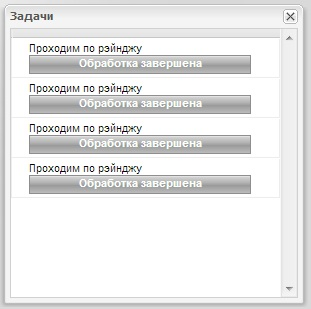

**********************************
Подробное описание клиента
**********************************

Клиентская часть разрабатывалась с такой целью чтобы можно было использовать LiveMessages с разными JavaScript библиотеками.

Пространство имен приложения живых сообщений называется *LiveMessages*.

Общий обзор
===========

*LiveMessages.AjaxWrapper* - Обертка для механизма Ajax запросов, используется для запросов на сервер.

*LiveMessages.Init* - точка входа в приложение, инициализация всех контроллеров и подписка их на получение сообщений от сервера через Socket.IO

*LiveMessages.AbstractController* - абстрактный контроллер приложения, предоставляет возможность реализовать запрос на сервер, обработать полученные сообщения и отправить обработанные сообщения во все вьюшки.

*LiveMessages.ExtBox* - абстрактный класс для окон, реализован на ExtJs, предоставляет возможность раскрывать и сворачивать окно, а также имеет метод принимающий сообщения которые передает контроллер.

*LiveMessages.Observable* - общий класс для удобной реализации навешивания обработчиков событий, от нее наследуются все абстрактные классы.

Механизм работы сообщений.
==========================

Скриншот окна сообщений.

.. image:: images/mini-window-messages.jpg

Клиент сообщений состоит из контроллера *LiveMessages.MessagesController* и вьюшки *LiveMessages.MessagesUI*.
Контроллер производит запрос на сервер, обрабатывает полученное сообщение и занимается ее передачей во вьюху.
Если нужно добавить новый обработчик запроса, то необходимо разработать метод в контроллере и добавить ссылку на этот обработчик в карте обработчиков *_handlerMapper*.
Соответственно, если необходимо изменить обработчик, то возможно изменить ее в коде, а возможно расширить класс контроллера и использовать свой класс вместо текущего контроллера.

Пример:

Необходимо передать во вьюху информацию о количестве непрочитанных сообщений. Для этого разрабатываем такой метод::

    messageNotReadCount: function (event, response) {
        this.sendDataToView(event, response['count']);
    }

и добавляем на этот обработчик ссылку, при вызове события вызывается соответсвующий обработчик::

    this._handlerMapper = {
        'delete': this.messageDelete,
        'query': this.handler,
        'read': this.messageRead,

        'countNotRead': this.messageNotReadCount
    };

Представление в сообщениях занимается получением сообщения и добавлением ее в свое хранилище store либо производит удаление, обновление. Шаблон представления связана с store и поэтому рендеринг сообщений происходит автоматически.
Скрипт взаимодействия с пользователем содержиться в блоке вместе с шаблоном, ее также можно перекрыть в процессе наследования или подкорректировать в коде.

Пример:

Вывести пользователю информацию о непрочитанных сообщениях::

    messageNotReadCount: function (count) {
        // Обрабатывается count и обновляет значение в дом узле.
    }

и указывается ссылка на этот обработчик::

    this._handlerMapper = {
        'delete'      : this.messageDelete,
        'query'       : this.addMessages,
        'socket'      : this.newMessage,
        'read'        : this.messageRead,

        'countNotRead': this.messageNotReadCount
    };

Механизм работы задач
=====================

Архитектура клиента задач такая же как и в сообщениях, состоит из контроллера *LiveMessages.TasksController* и вьюшки *LiveMessages.TasksUI*.
Отличия только в функционале, и совсем другой шаблон представления.

Скриншот окна сообщений.

