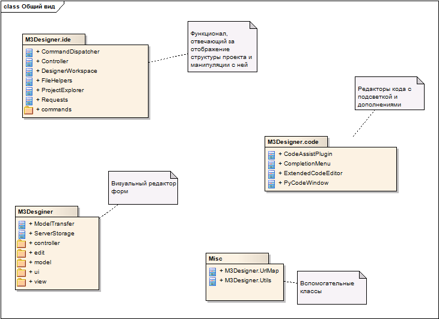
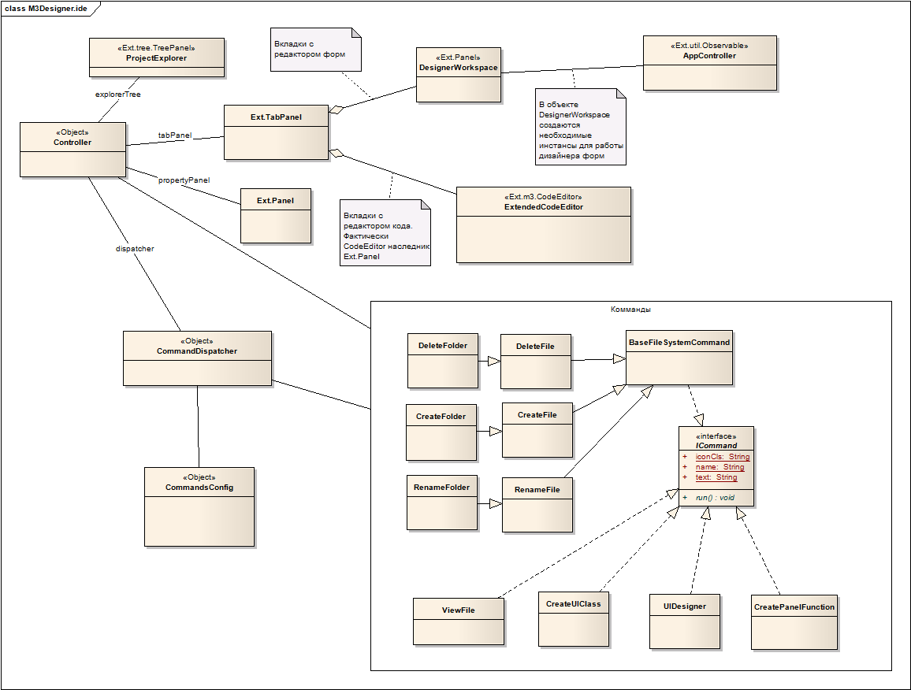
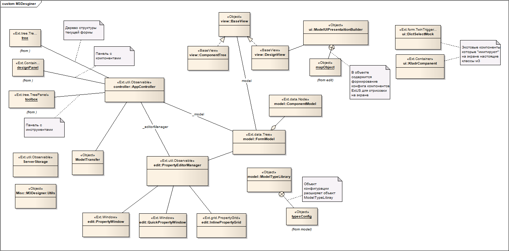
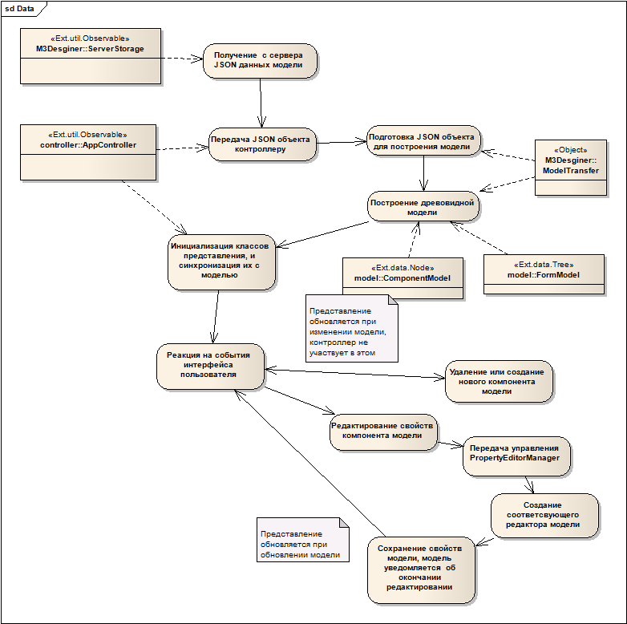

**********************************
Архитектура клиентского приложения
**********************************

Общий обзор
===========

.. note::
    Оригинальный файл с диаграммами классов(проект Enterprise Architect) лежит в репозитарии /m3_designer/doc/m3-ide.eap

M3Designer.UrlMap
=================

Контейнер для серверных адресов, необходим для работы(если какой-то из адресов не задан - будут выкидываться ошибки).
Поэтому нужно сконфигурировать адреса таким образом(в отдельном js файле или в самой html страниче - главное до запросов на сервер)::

    M3Designer.UrlMap.addUrls({
                    'save-file-content':'/designer/file-content/save',
                    'get-file-content':'/designer/file-content',
                    'get-template-global':'/designer/project-global-template',
                    'manipulation':'/designer/project-manipulation',
                    'data':'/designer/data',
                    'save':'/designer/save',
                    'preview':'/designer/preview',
                    'upload-code':'/designer/upload-code',
                    'code-assist':'/designer/codeassist',
                    'create-autogen-function' : 'create-autogen-function',
                    'create-function': '/create-function',
                    'create-new-class': '/create-new-class',
                    'project-files': '/project-files'
    });

M3Desginer.ide
==============

Код в этом пространстве имен рисует дерево структуры проекта, панель с вкладками, обрабатывает данные с сервера, и производит
все манипуляции с проектом. Основные классы:

**ProjectExplorer** - наследник экстового дерева. Отображает структуру проекта.

**Controller** - контроллер приложения. Фактически, точка входа. В качестве параметров конструктора принимает интерфейсные объекты (дерево проекта, табпанель),
на события которых начинает реагировать.

**ComnmandDispatcher** - диспетчер комманд. Вся логика работы над проектом описывается с помощью классов комманд.
Более подробно можно посмотреть в комментариях в файлах /ide/controller.js и /ide/commands.js. Именно там нужно смотреть,
если требуется добавить в IDE часть дизайнера новый функционал. Обратное взаимодействие с интерфейсом осуществляется
через обращения к экземпляру контроллера.

**CommandsConfig** - настройка соответствия типов вершин в структуре проекта и возможных действий над ними.

**Requests** - запросы к серверу плюс часть логики работы. Это устаревший код, и должен быть исправлен(логика должна быть
перенесена в комманды)

.. note::

    Логика работы со структурой проекта основывается на типах вершин. Когда с сервера передаются данные, у каждой вершины указывается атрибут type, например "type":"file"
    

UI Designer
===========

Общая диаграмма классов

Общая концепция строения это MVC. Модель представляет собой дерево с вершинами. Контроллер - объект реагирующий на пользовательские события и обновляющий модель.
Представления - два класса, что синхронизированы с моделью. Под синхронизацией понимается обработка событий обновления модели(добавление, удаление, измнение узлов дерева)

**Важно:** Контроллер не обновляет экранное представление. Экранное представление обновляется само по себе при изменениях модели.

Структура поведения подсистемы:

Описание основных классов, подробнее - смотреть комментарии в коде:

**AppController** - контроллер обрабатывающий действия пользователя

**FormModel и ComponentModel** - древовидная модель и ее узлы

**ModelTypeLibrary** - содержит "бизнесс" логику по работе с моделями

**BaseView** - базовый класс представления, синхронизирующийся с моделью

**ComponentView** - структура формы - отображает модель в TreePanel на экране

**DesignView** - визуальный просмотр модели на экране. Принцип перерисовки заключается в очистке содержимого экстовой панели и пересоздание JavaScript компонентов

**ModelUIPresentationBuilder** - отвечает за формирование конфигов ExtJS из объектов модели, для работы DesignView

**PropertyEditorManager** - управляет редактированием моделей. Фактически это тоже контроллер, что создает окна и гриды для редактирования, и потом обновляет модель

**QuickPropertyWindow** - окошко быстрого редактирования

**PropertyWindow** - окошко обычного редактирования

**InlinePropertyGrid** - грид редактирования модели, встраиваемый в аккардеон панель

**ModelTransfer** - класс для сериализации и десериализации модели в транспортный JSON

**ServerStorage** - взаимодействие с сервером

.. note::
    Более подробно о свойствах модели можно прочитать в соответсвующем разделе справки
    :ref:`components`

Code editor
===========
Наиболее очевидный блок системы

**ExtendedCodeEditor** - Экстовая панель с CodeMirror редактором

**CodeAssistPlugin** - Плагин в терминах ExtJS. Присоединяется к панели ExtendedCodeEditor, слущает нажатие клавиш с
клавиатуры, передает на сервер текущий файл в текущем состоянии(целиком) и положение курсора. Если сервер возвращает предложения о дополнении кода,
создает меню с дополнениями

**CompletionMenu** - меню дополнений

**PyCodeWindow** - Legacy код. Окошко с эдитором питоновского кода, используется для предпросмотра кода генерируемого UI-Designer'ом.

