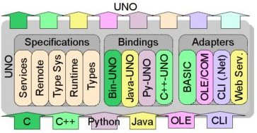
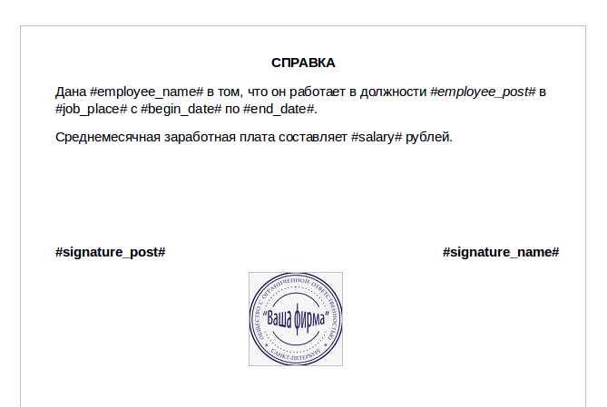
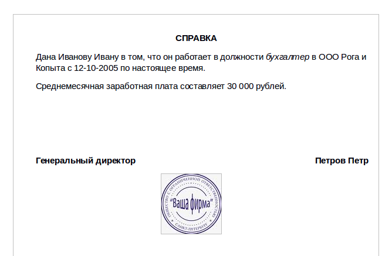
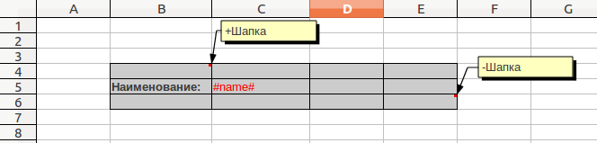
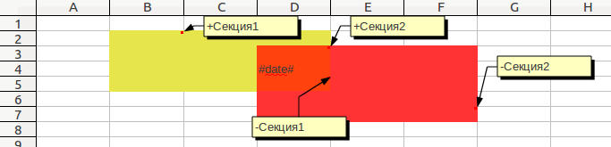
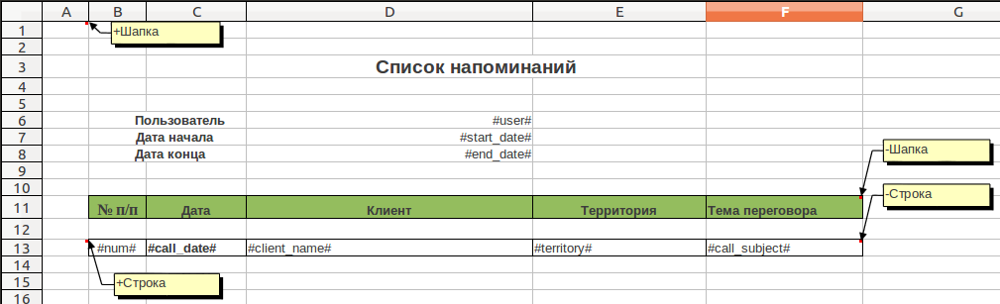
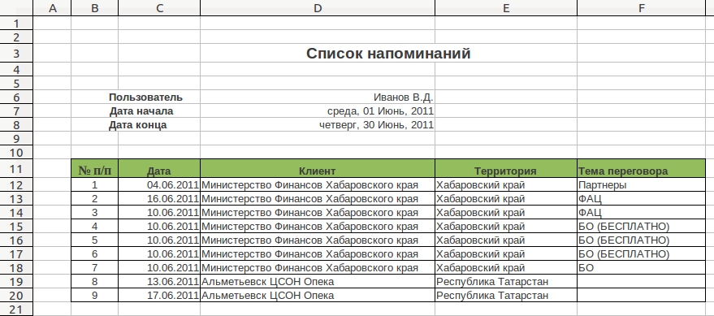
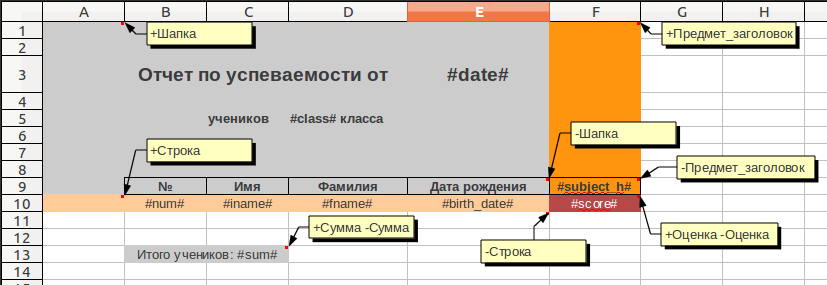
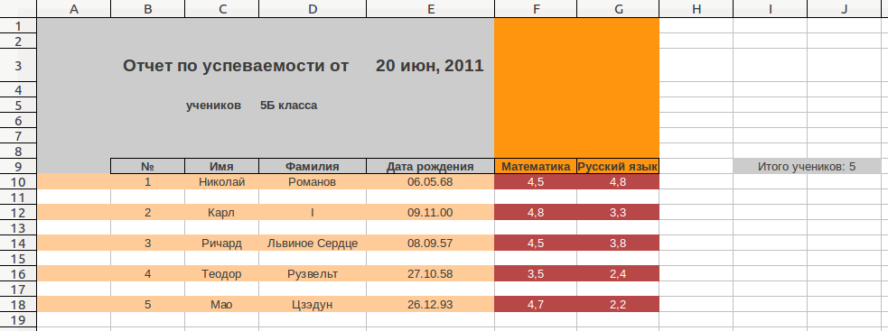

.. _report_generation:

Генератор отчетов (m3.core.report_generation)
===================================================

Принципы работы
---------------

Работа генератора отчетов основана на манипулировании документами с помощью API OpenOffice. Основной технологией OpenOffice.org выступает UNO (Universal Network Objects – Универсальные Сетевые Объекты). Эта технология позволяет использовать и создавать компоненты, работающие независимо от языка программирования.

Доступ к API осуществляется с помощью модуля PyUNO.

OpenOffice должен быть запущен в качестве сервера в момент генерации отчета.  

Отчеты строятся на основе файлов-шаблонов со специальными тегами внутри. Допустимые форматы шаблонов для отчетов-документов: .doc и .odt. Допустимые форматы шаблонов для отчетов-электронных таблиц: .xls и .ods.

Настройка окружения
-------------------

Для работы генератора отчетов необходимо установить дистрибутив офисного пакета OpenOffice.org версии не ниже 3.2. 

В Windows также необходимо добавить путь к файлу soffice.exe в переменную окружения PATH.

Для того, чтобы сервер OpenOffice стартовал одновременно с запуском приложения, необходимо в файл manage_dev.py добавить:

* Импорт ::

	from m3.core.report_generation.oo_admin import start_server

Он должен располагаться после блока связки с платформой M3.

* Функцию для запуска сервера *start_server()* 
	Она должна располагаться перед вызовом функции *execute_manager*, после импорта модуля settings.

	.. autofunction::  m3.core.report_generation.oo_admin.start_server
	Параметр *headless_mode=True* запускает OpenOffice в режиме, в котором не происходит отображения действий над файлами на экране. 
  
	*headless_mode=True* рекомендуется использовать в случае, если в отображении на экране нет необходимости. При этом важно учитывать, что в Linux все документы будут открываться в этом режиме, и у разработчика не будет возможности открывать для просмотра файлы в программе OpenOffice.

	*headless_mode=False* рекомендуется использовать в процессе разработки отчета.

Пример того, как может выглядеть запуск сервера в файле manage_dev.py::

	from django.core.management import execute_manager
	try:
    	    import settings # Assumed to be in the same directory.
	except ImportError:
    	    import sys
    	    sys.stderr.write("Error: Can't find the file 'settings.py' in the directory containing %r. It appears you've customized things.\nYou'll have to run django-admin.py, passing it your settings module.\n(If the file settings.py does indeed exist, it's causing an ImportError somehow.)\n" % __file__)
    	    sys.exit(1)

	#Запуск сервера OpenOffice, используется в генераторе отчетов
	from m3.core.report_generation.oo_admin import start_server
	start_server(headless_mode=False)
	
	if __name__ == "__main__":
    	    execute_manager(settings)

Генератор отчетов в процессе своей работы создает временные файлы. Расположение временных файлов может быть задано в settings.py в переменной REPORT_TEMPORARY_FILE_PATH. Если значение этой переменной не задано, по умолчанию файлы записываются в папку, которая возвращается функцией `tempfile.gettempdir()  <http://docs.python.org/library/tempfile.html#tempfile.gettempdir>`_. 

Отчеты в виде текстовых документов
----------------------------------

Классы и методы
+++++++++++++++

.. module:: m3.core.report_generation.report

.. autoclass:: DocumentReport
   :members: show, clean_temporary_file

Возможности
+++++++++++

1. Построение отчета на основе шаблона в формате .doc и .odt.

2. Подстановка строк с сохранением форматирования. 
	Для подстановки значения в переменную существует тег **#variable#**. Для сохранения форматирования при подстановке значения переменной теги также должны быть отформатированы.

3. Экспорт в форматы, поддерживаемые OpenOffice (doc, odt, pdf, html, txt, итд). 
	Формат документа отчета задается при вызове метода show объекта *SpreadsheetReport*. Openoffice позволяет указать множество различных форматов.  Некоторые из возможных значений фильтра:

	* "writer_pdf_Export" - pdf
	* "MS Word 97" - doc
	* "Rich Text Format" - rtf
	* "HTML" - html
	* "Text" - txt
	* "writer8" - odt
	По умолчанию используется фильтр "writer8".

4. Сохранение картинок и их расположения в документе отчета. 
	Картинки, добавленные в файл шаблона, сохраняются в результирующем файле.

Примеры использования
+++++++++++++++++++++

Шаблон:

Код программы::

	report = DocumentReport(template_path) 
	params = {'employee_name':employee_name, 'employee_post':employee_post} 
	params['job_place'] = job_place 
	params['begin_date'] = begin_date 
	params['end_date'] = end_date 
	params['salary'] = salary 
	params['signature_post'] = signature_post 
	report.show(document_file, params, 'MS Word 97')

Результат:

Отчеты в виде электронных таблиц
--------------------------------

В основе принципа построения отчета-электронной таблицы лежит понятие секции. 

**Секция** — это именованная область таблицы, предназначенная для многократного вывода. Секция задается своими верхней левой и нижней правой ячейками. 

Чтобы задать секцию с именем Шапка, необходимо:
	* Добавить в комментарий левой верхней ячейки текст +Шапка
	* Добавить в комментарий правой нижней ячейки текст -Шапка 

Пример: выделенная серым цветом область ячеек принадлежит секции с названием Шапка.

Секции могут пересекаться :

В одной ячейке можно задавать несколько границ секций, названия секций должны быть разделены пробелом:

.. image:: images/report_generation/score.png

Секции должны быть заданы в первом листе шаблона. Название секции является регистрозависимым. 

Классы и методы
+++++++++++++++

.. autoclass:: SpreadsheetReport
   :members: get_section, get_section_render_position, set_section_render_position, show

.. autoclass:: Section
   :members: flush, create_image

.. autoclass:: OOImage
   :members: load_from_file   

Возможности
+++++++++++

1. Построение отчета на основе шаблона в формате .xls и .ods.

2. Подстановка строк, дат и чисел в ячейки с сохранением форматирования. 
	Для подстановки значения в переменную существует тег **#variable#**. Для сохранения форматирования при подстановке значения переменной теги также должны быть отформатированы. Формат отображения даты задается установкой необходимого формата даты в свойствах ячейки электронной таблицы. Формат отображения чисел также задается установкой свойств ячейки. 

3. Подстановка нескольких значений в ячейку. 
	В одной ячейке может содержаться и обычный текст, и произвольное количество переменных.

	Пример:

	.. image:: images/report_generation/text_with_vars.png

4. Вывод секций в горизонтальном направлении.
	Для того, чтобы вывести секцию горизонтально, необходимо при вызове метода секции flush указать значение параметра vertical=False. Секция будет напечатана справа от последней выведенной секции. 
5. Вывод секций в вертикальном направлении.
	Для того, чтобы вывести секцию вертикально, необходимо при вызове метода секции flush указать значение параметра vertical=True (это значение используется по умолчанию). Секция будет напечатана с левого края листа, ниже ранее выведенных секций.
6. Экспорт в форматы, поддерживаемые OpenOffice (xls, ods, pdf, html итд).
	Формат документа с результатом задается при вызове метода show объекта SpreadsheetReport. Openoffice позволяет указать множество различных форматов. Некоторые из возможных значений фильтра: 
	
	* "writer_pdf_Export" - pdf
	* "MS Excel 97" - xls
	* "HTML (StarCalc)" - html
	* "calc8" — ods
	По умолчанию используется формат "calc8".
7. Сохранение высоты строк и перенос по словам.
	Для того, чтобы высота строки изменялась в зависимости от содержимого ячейки, необходимо в файле шаблона в свойствах ячейки указать «Переносить по словам».
	При этом нужно учитывать, что, если в одной строке было выведено несколько ячеек с разными значениями высоты, то в результате высота строки будет соответствовать значению высоты в первой выведенной в строке ячейке.
8. Сохранение ширины столбцов.
	Если в одном столбце было выведено несколько ячеек с разными значениями ширины,   в результате ширина столбца будет соответствовать значению ширины в первой выведенной в столбце ячейке.
9. Вывод секции в заданную ячейку.
	По умолчанию секции выводятся правее (при выводе горизонтально) или ниже (при выводе вертикально) предыдущих выведенных секций. Для того, чтобы задать координаты ячейки, которая будет соответствовать левому верхнему углу следующей выводимой секции, существует метод  set_section_render_position объекта SpreadsheetReport. Установленная с помощью данного метода позиция будет актуальна только для следующей выведенной в отчет секции. После вывода одной секции вывод вновь будет осуществляться по стандартному алгоритму, без учета секции, выведенной в произвольную ячейку. При этом разработчик должен сам следить за тем, чтобы выведенные секции не перезаписывали друг друга. Получить координаты ячейки, с которой будет выводиться в отчет следующая секция, можно с помощью метода get_section_render_position объекта *SpreadsheetReport*.
10. Вывод картинки из файла в секцию.
	Для того, чтобы вывести секцию с картинкой, необходимо: 

	* В файле шаблона в одной из ячеек секции добавить тег в формате **. Где параметр *img_name* - название картинки, по которому будет осуществляться доступ к картинке из программы. 
	* Получить объект картинки *OOImage* в программе. Для этого у секции необходимо вызвать метод *create_image(name)* с аргументом *image_name*. 
	* Загрузить в полученную из секции картинку файл с помощью метода *load_from_file(path)*. 
	* Задать высоту картинки (в единицах 1/100 сантиметра): ``image.height = 1000`` 
	* Задать ширину картинки (в единицах 1/100 сантиметра): ``image.width = 1000`` 
	* Задать расположение картинки. Расположение задается смещением картинки относительно левого верхнего угла ячейки, в которой был задан соответствующий ей тег (в единицах 1/100 сантиметра): ``image.position = (50, 50)``

	Если изображения должны меняться при каждом выводе секции, нет необходимости каждый раз создавать объект картинки, достаточно загружать новый файл с помощью метода *load_from_file(path)*. 
	
	Если в одной секции заданы несколько одинаковых тегов для картинок, изображение автоматически загрузиться во все ячейки с одинаковыми тегами.
	
	Таким образом, код программы для вставки картинки может выглядеть так:
::

	report = SpreadsheetReport(temp_path)
	header = report.get_section(u'Шапка')
	pupil_image = header.create_image('pupil')
	pupil_image.load_from_file(pupil_path)
	pupil_image.width = 1500
	pupil_image.height = 1500
	pupil_image.position = (100,100)
	header.flush({data})
	

11. Вставка в отчет разрыва страницы.
	Для вставки в отчет разрыва необходимо добавить в файл шаблона разрыв, пересекающий секцию. При выводе секции, в которой содержится разрыв, положение разрыва относительно секции сохранится. Разрывы, расположенные на границе секции, также считаются входящими в секцию.

	Пример:

	.. image:: images/report_generation/page_breaks.png

	В данном примере шаблон содержит разрыв по нижней границе строки с номером 11. В результате в отчет будет вставлен разрыв страницы в конце каждой секции "Информация".

Примеры использования
+++++++++++++++++++++

1) Шаблон:

Код программы::

	report = SpreadsheetReport(temp_path)
	header = report.get_section(u'Шапка')
	section = report.get_section(u'Строка') 
	header.flush({'user':user.username,'start_date':context.start_date,'end_date':context.end_date})
	num=1
	for reminder in reminders:
	    row_dicionary = {'num':num, 'call_date':reminder.date, 'client_name':reminder.call.contragent.name()}
	    dic['territory'] = client.territory.name
	    dic['product'] = reminder.call.product.name
	    dic['call_subject'] = reminder.call.subject
	    section.flush(dic)
	    num+=1
	report.show(xls_file_path, 'MS Excel 97')

Результат:

2) Шаблон:

Код программы::

	report = SpreadsheetReport(temp_path)
	header = report.get_section(u'Шапка')
	section = report.get_section(u'Строка')
	sum = report.get_section(u'Сумма')
	subject_header = report.get_section(u'Предмет_заголовок')
	score = report.get_section(u'Оценка') 
	header.flush({'date':datetime.datetime.now(),'class':u'5Б'})
	subject_header.flush({'subject_h':u'Математика'},vertical=False)
	subject_header.flush({'subject_h':u'Русский язык'},vertical=False)
	num=0
	for student in students:
    	    num+=1
    	    params = {'num':num, 'iname':student['iname'], 'fname':student['fname'], 'birth_date':student['birth_date']}
    	    section.flush(params)
    	    score.flush({'score':student['scores'][0]},vertical=False)
    	    score.flush({'score':student['scores'][1]},vertical=False)
	    report.set_section_render_position(8,8)
	    sum.flush({'sum':num})                  
	report.show(xls_file_path, 'MS Excel 97')

Результат:

3) Шаблон:

.. image:: images/report_generation/excel_images_template.png

Код программы::

        report = SpreadsheetReport(temp_path)
        header = report.get_section(u'Шапка')
        header_img = header.create_image('planets')
        header_img.load_from_file('planets/images.jpg')
        header_img.width = 2500
        header_img.height = 2500
        header.flush({})
        planet_name = report.get_section(u'Название')
        info = report.get_section(u'Информация')
        info_img = info.create_image('planet')
        info_img.width = 2000
        info_img.height = 2000
        info_img.position = (2000,150)
        num = 0
        for planet in planets:                   
            num+=1
            planet_name.flush({'planet_name':planet['name']})
            info_img.load_from_file('planets/'+planet['image'])
            info.flush(planet)                  
        report.show(xls_file_url, 'MS Excel 97')

Результат:

.. image:: images/report_generation/excel_images_result.png

