*********************
Примеры работы с КЗиО
*********************

Постановка задачи
=================

Имеется две модели: ``MarkCard`` и ``AutoCard``. Они связаны соотношением один ко многим.
Необходимо составить табличный отчет, который будет выводить марку(запись из
таблицы ``MarkCard``), все авто этой марки(связанные записи из таблицы ``AutoCard``), включая
их цену, суммарную стоимость авто каждой марки. И в конце суммарную стоимость авто всех марок.

Подготовка запросов
====================

Для реализации отчета необходимо подготовить 4 запроса:
    1) Марки и связанные с ними авто.
    2) Суммарная стоимость авто по маркам.
    3) Суммарная стоимость всех авто.
    4) Запрос на получение пользователя по его идентификатору.

Для реализации первого запроса, необходимо добавить две модели ``MarkCard``, ``AutoCard`` и указать на их связь.

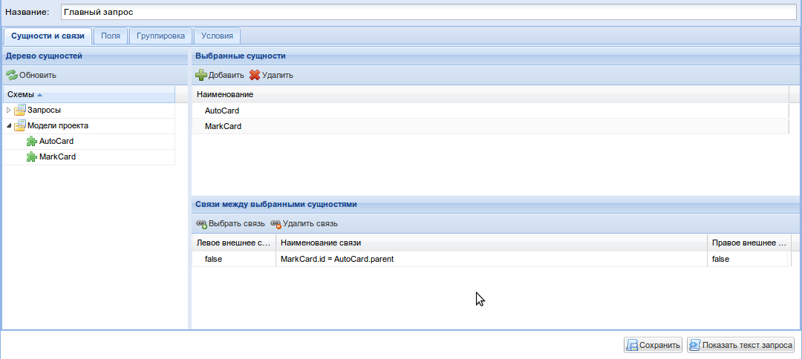

Далее добавляются поля и указываются их алиасы.

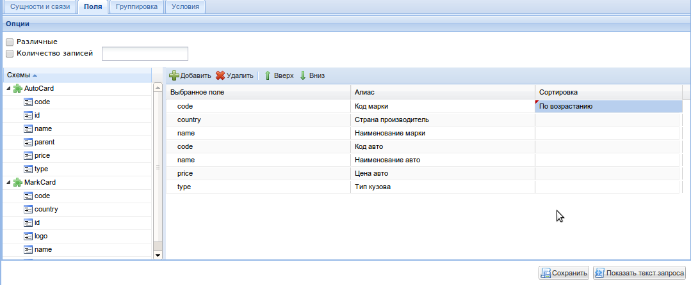

В данном примере алиасы необходимы лишь для удобства восприятия.
Однако возникают ситуации, когда они жизненно необходимы. Например, несколько
моделей имеют поля с одинаковым именем, а также запрос, который использует их.
Тогда при повторном использовании запроса будет не понятно какое из полей мы имеем в виду.

В данном запросе не используются группировки, агрегации и условия. Результат можно проверить нажав
на кнопку "Показать текст запроса".

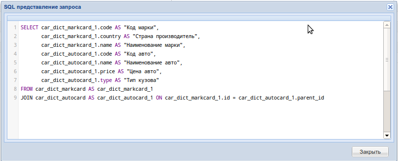

Второй запрос можно реализовать, использую первый. Для этого, необходимо добавить его:

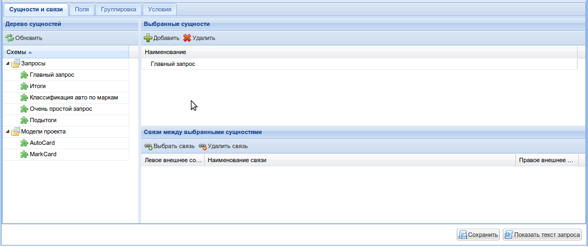

Добавляется поле "Цена авто" и указывается функция агрегации:

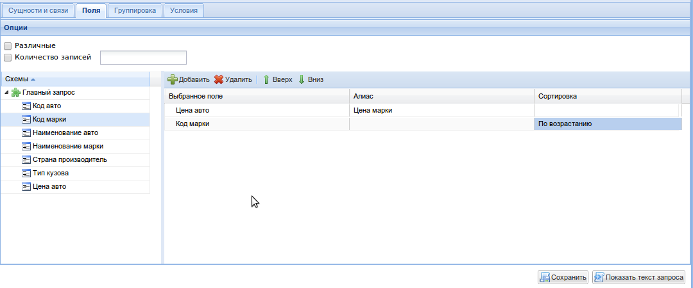
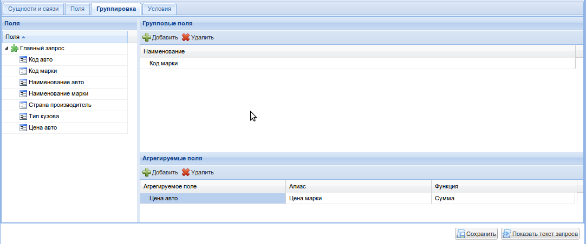

Важно отметить, что как и в главном запросе поле "Код марки" отсортировано. Это
необходимо для соответствия записей из главного запроса и из данного.

В данном запросе условия не указываются.

.. image:: images/example/second_query_result.png

Третий запрос можно реализовать например, используя второй

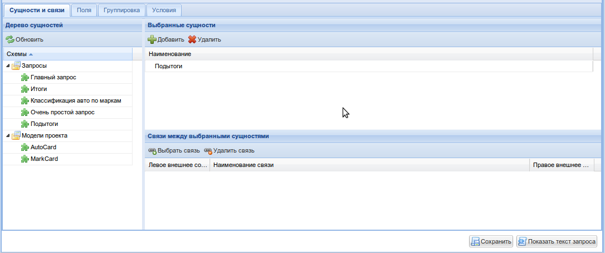
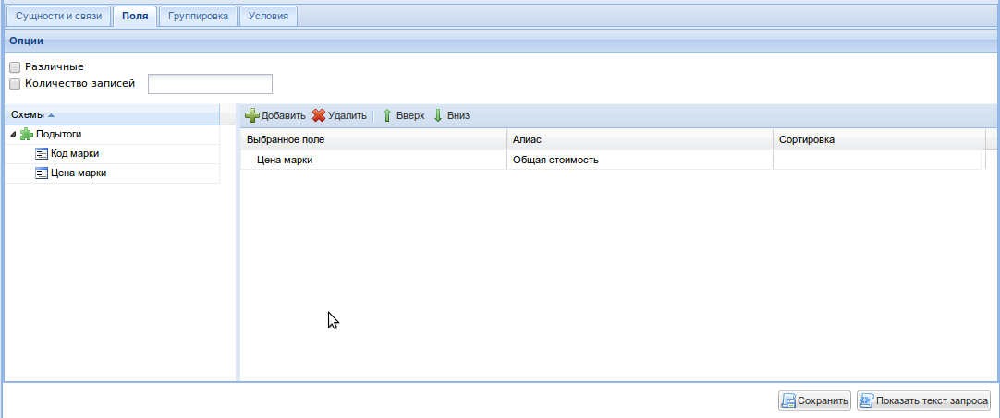
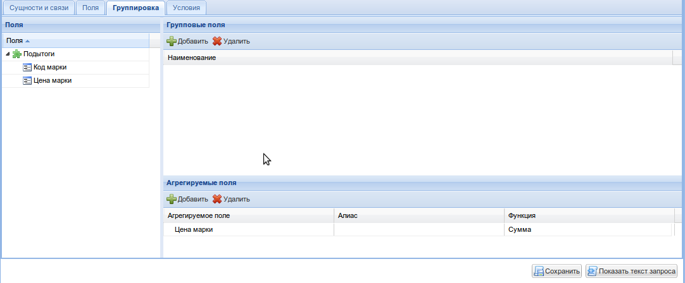
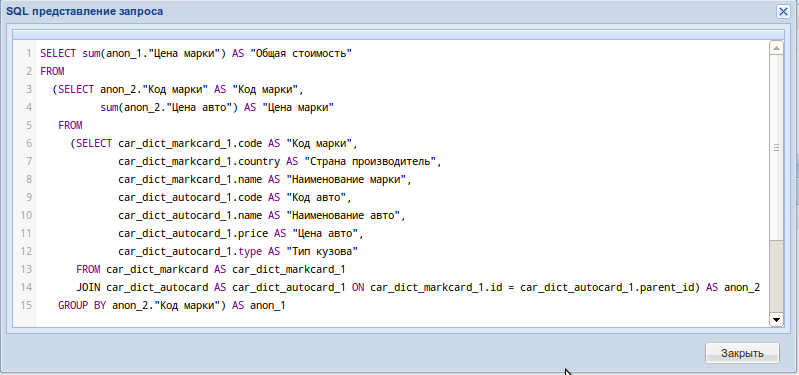

Четвертый запрос:

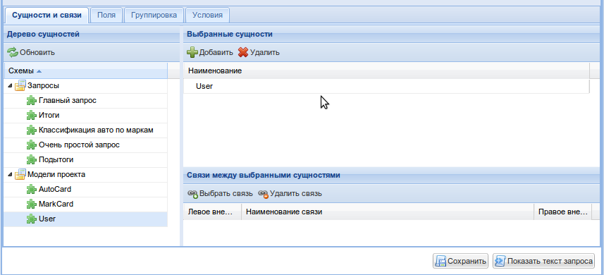

В данном запросе имеется условие:

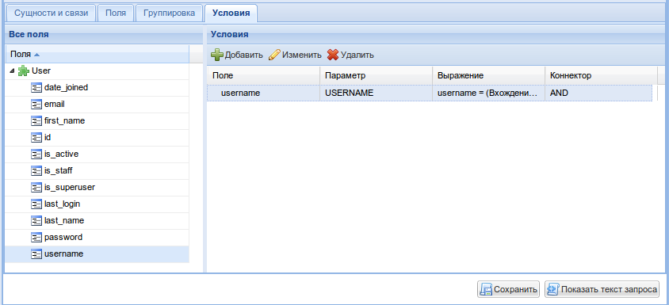

Так выглядит SQL - код запроса:

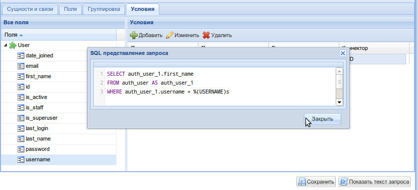

Запросы, готовы.

Построение отчета
==================

Для отчета используется следующий шаблон:

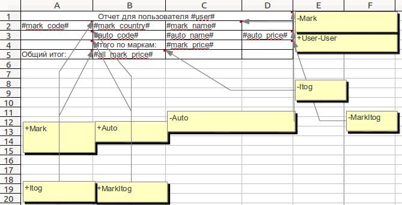

Все, что нужно добавить четыри созданных запроса в отчет, загрузить шаблон и соотнести их.

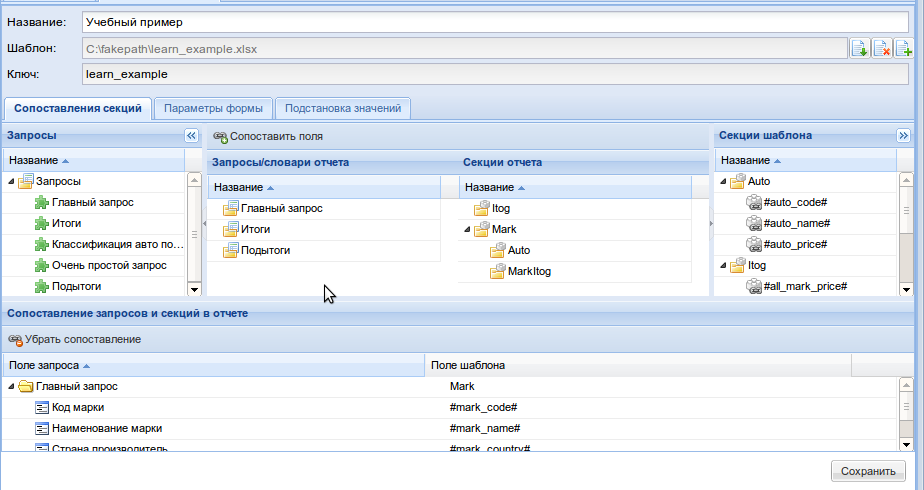

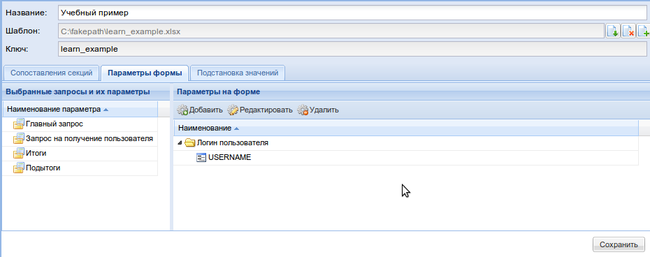

Стоит обратить внимание на иерархию секций шаблона. Секции ``Auto`` и ``MarkItog``, являются
дочерними по отношению к секции ``Mark``, т.к. вывод в эти секции должен чередоваться.
Т.е. выводится запись в секцию ``Mark``, далее все записи, связанные с маркой, в секцию ``Auto`` и
наконец запись в секцию ``MarkItog``, после чего все повторяется ...

Вот так выглядит результат:

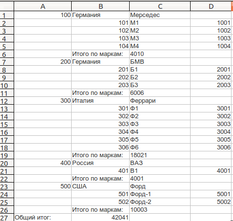