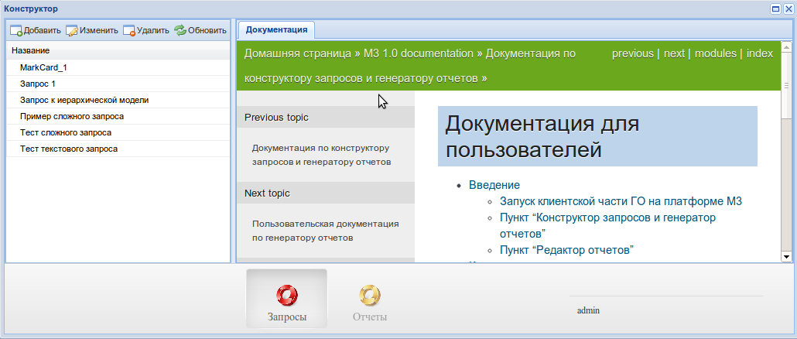

.. _user_m3_query_builder:

Пользовательская документация по конструктору запросов и отчетов
==============================================================================

Конструктор (далее КЗиО) предназначен для создания простых отчетов,
которые могут отображать произвольный набор данных. На выходе КЗиО
отдает заполненный данными отчет в виде электронного документа.

Под электронным документом подразумевается файл, который может быть открыт
линейкой продуктов Microsoft Office, либо OpenOffice, либо электронный документ
является документом типа PDF.

Преимущества и недостатки
==========================

КЗиО предоставляет пользовательский интерфейс для создания запросов и отчетов, что
позволяет переложить часть работы с разработчика на аналитика.

Конструктор запросов позволяет создавать сложные отчеты с многочисленными связями,
агрегацией, группировками и простыми условиями.

Конструктор отчетов узко специализирован. Дело в том, что при создании отчета средствами
генератора отчетов ``simple_report`` разработчик управляет процессом вывода данных. Однако
при создании отчета средствами КЗиО данная гибкость недостижима. Поэтому конструктор отчетов
заточен на создание определенного типа отчетов.

Запуск КЗиО на платформе М3
"""""""""""""""""""""""""""""""""""""""""""

Если КЗиО подключен, то в зависимости от прописанных настроек будет доступен пункт меню
или ярлык для запуска. Если настройки отсутствуют, то будет добавлен ярлык.

При нажатие откроется окно на всю ширину браузера. В окне представлен интерфейс КЗиО.

Интерфейс состоит из двух частей: конструктор запросов и конструктор отчетов.

Подробнее о работе с конструктором запросов :ref:`здесь <user_query_builder>`.

Подробнее о работе с конструктором отчетов :ref:`здесь <user_report_builder>`.

