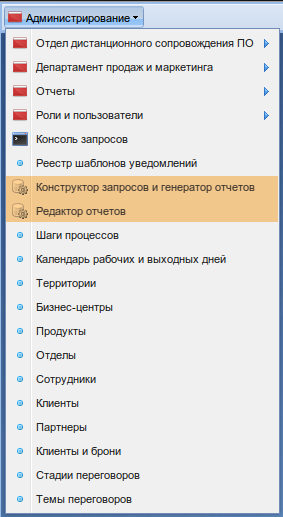

.. _user_m3_query_builder:

Пользовательская документация по генератору отчетов
==============================================================================

Генератор отчетов (далее ГО) предназначен для создания произвольных отчетов,
которые могут отображать произвольный набор данных. На выходе ГО
отдает заполненный данными отчет в виде электронного документа.

Под электронным документом подразумевается файл, который может быть открыт
линейкой продуктов Microsoft Office, либо OpenOffice, либо электронный документ
является документом типа PDF.

Приложение состоит из двух частей: серверной и клиентской. Серверная часть в
свою очередь тоже разделена на две части: конструктор запросов и генератор
отчетов.

Данная документация касается клиентской части только для платформы М3, однако
документация для серверной части остается неизменной для любой платформы.

Запуск клиентской части ГО на платформе М3
"""""""""""""""""""""""""""""""""""""""""""

Если клиент ГО подключен, в меню "Администрирование" должно появиться два новых
пункта: "Конструктор запросов и генератор отчетов" и "Редактор отчетов".

Пункт "Конструктор запросов и генератор отчетов"
""""""""""""""""""""""""""""""""""""""""""""""""

.. image:: ../images/user/go_window.png

Данный пункт откроет перед пользователем окно на всю ширину браузера, в котором
будет представлен серверный интерфейс.

Серверный интерфейс состоит из двух частей: конструктора запросов и генератора
отчетов.

Подробнее о работе с конструктором запросов :ref:`здесь <user_query_builder>`.

Подробнее о работе с генератором отчетов :ref:`здесь <user_report_generation>`.

Пункт "Редактор отчетов"
"""""""""""""""""""""""""

.. image:: ../images/user/client_window.png

Данный пункт откроет список доступных для заполнения отчетов.

Подробнее о получении заполненных отчетов :ref:`здесь <user_report_editor>`.

