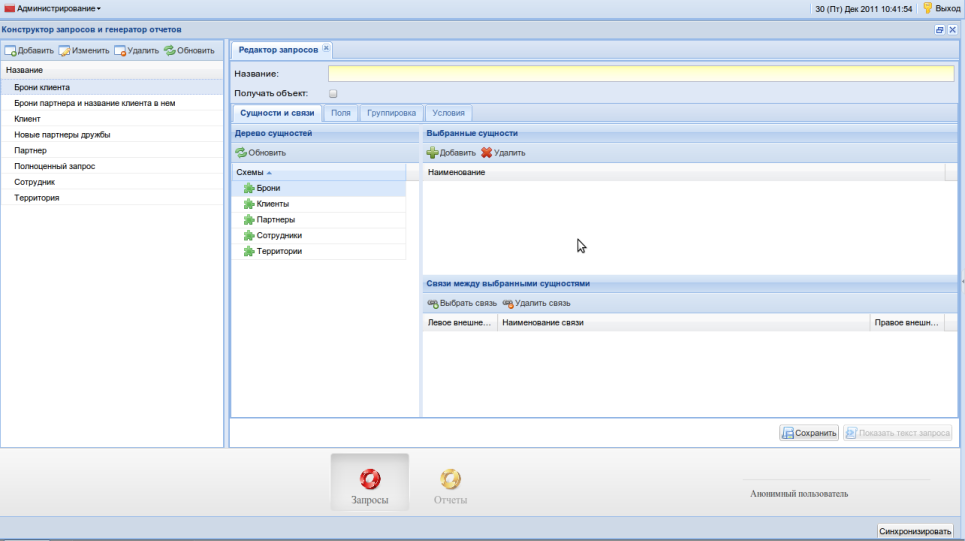
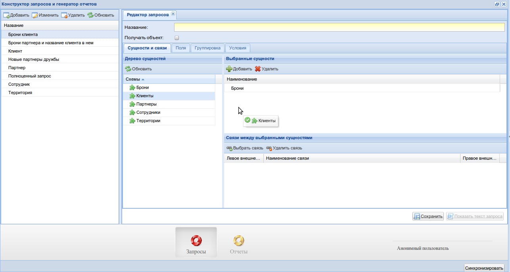
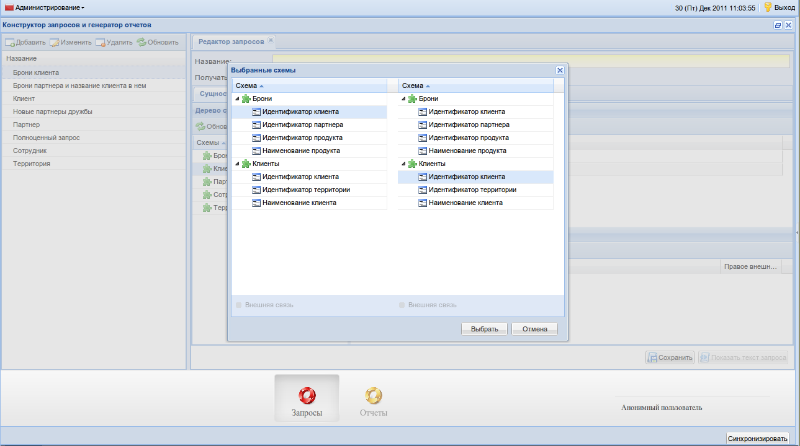
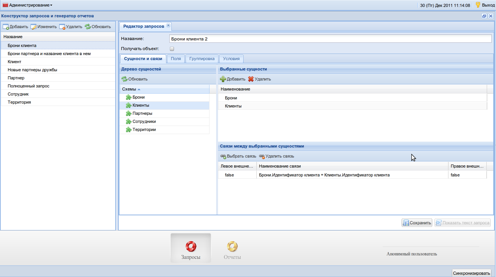
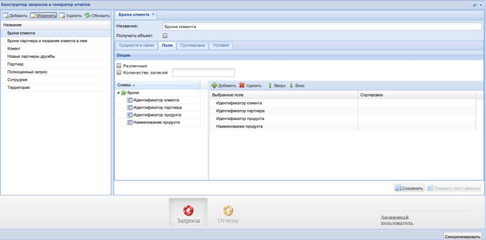
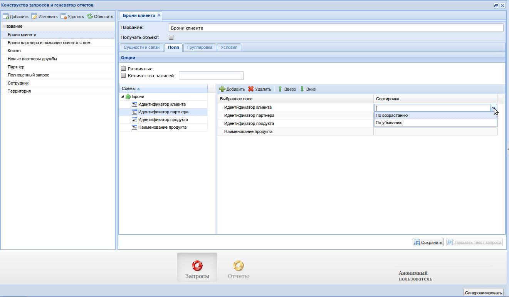
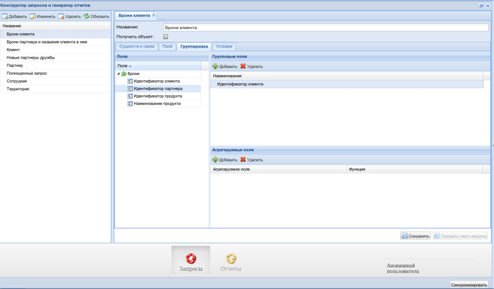
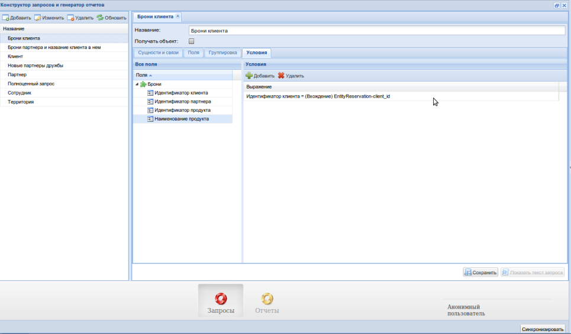
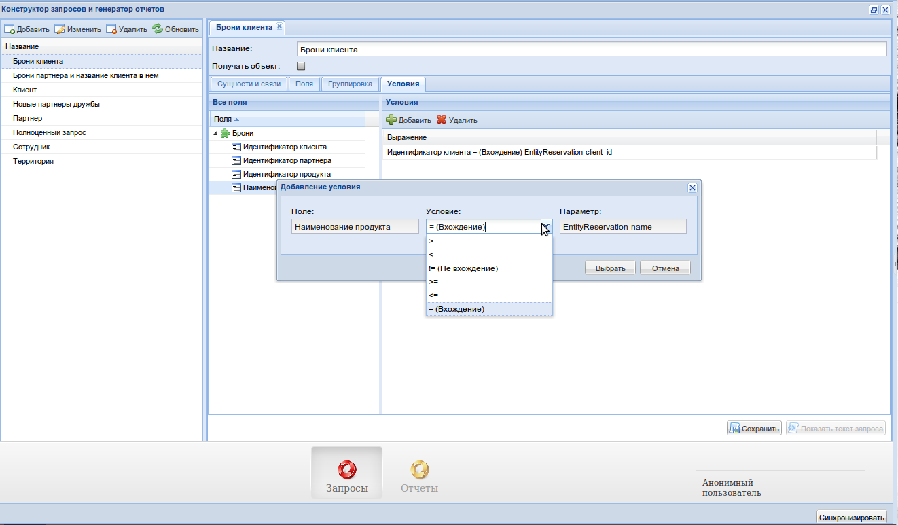

.. _user_query_builder:

Конструктор запросов
===================

Конструктор запросов позволяет динамически строить sql запрос с помощью
веб-интерфейса.

При открытии интерфейса серверной части ГО по умолчанию должна открыться
вкладка конструктора запросов. Чтобы быть уверенным, что вы находитесь на вкладке
конструктора запросов, убедитесь, что выделена вкладка "Запросы", как на рисунке
ниже

.. image:: ../images/user/qb_begin.png

Создание, изменение и удаление запросов
"""""""""""""""""""""""""""""""""""""""

Для того, чтобы добавить запрос, нажмите на кнопку добавить в таблице слева.

Чтобы изменить запрос, два раза кликните по запросу в таблице, или выберите
запрос и нажмите на кнопку "Изменить".

Для удаления запроса, выберите запрос, и нажмите на кнопку "Удалить".

Для того, чтобы обновить таблице запросов, нажмите на кнопку "Обновить".
Обновляйте таблицу после каждого добавления или изменения запроса, автоматически
этого не происходит.

Попробуем создать новый запрос.

Вкладка "Сущности и связи"
"""""""""""""""""""""""""""

При нажатии на кнопку "Добавить" таблицы запросов, на коллекции вкладок справа
должна появиться новая вкладка. Вот как она может выглядеть:

Подробнее разберем каждый элемент вкладки.

Слева, в "Дереве сущностей", находятся имеющиеся схемы (сущности) в проекте.
Они запрограммированы создателями конкретной клиентской системы, и изменить
их на сервере невозможно.

Сущности представляют собой абстракцию над таблицами в клиентской БД, и
позволяют аналитикам работать с этими объектами, не задумываясь о технической
реализации.

На основе сущностей строятся все запросы.

Попробуем добавить две сущности в наш запрос.

Выбираем сущность "*Брони*" и "*Клиенты*" и переносим их в
выбранные сущности. Эта, и многие прочие операции переноса и добавления поддерживают
Drag & Drop (зажатие кнопки мыши и перетаскивание).

После чего можно выбрать связь между сущностями щелкнув на кнопку
"*Выбрать связь*".

Свяжем клиентов с их бронями. Для этого на одной стороне нужно выбрать поле
"*Идентификатор клиента*" в схеме "Брони", а на другой стороне выбрать поле
"*Идентификатор клиента*" в схеме "Клиенты". Ориентация сторон (левая, правая)
не имеет значения.

Два флага "Внешняя связь" внизу пока выбрать невозможно.

Добавим название к запросу: "*Брони клиента*".

Вот что мы получим:

Еще одна важная деталь: галочка "*Получать объект*". Она отвечает за то, будем
ли мы получать список элементов, или только первый найденный по указанному
запросу.

Запросы, составленные с указанной галочкой, обозначаются как "*Словари*", в то
время как запросы, составленные без указанной галочки, так и называются:
"*Запросы*".

Разница между понятиями проявляется на этапе составления отчета, и будет
рассмотрена в соответствующем пункте документации.

Вкладка "Поля"
"""""""""""""""""""""""""""

На этой вкладке должны быть выбраны поля из выбранных ранее на первой вкладки сущностей.
Эти поля будут отображаться в select'e запроса. Так же имеется возможность задать сортировку
каждому полю по возрастанию, либо по убыванию.

Для того, чтобы учитывать поле в запросе, необходимо выбрать поле в дереве
"Схемы" слева, и либо нажать кнопку "Добавить", либо зажать поле, и перетащить
его в таблицу справа.

Чтобы указать сортировку, нужно два раза щелкнуть на поле "Сортировка" нужной
строки таблицы в таблице справа, после чего выбрать необходимое направление
из выпадающего списка, как на рисунке ниже:

Флаг "*Различные*" указывает на то, что повторяющиеся записи выбираться не будут,
аналогично ключевому слову ``DISTINCT`` в SQL.

Флаг "*Количество записей*" с числом указывает на то, что будет выбрано только
определенное количество записей, аналогично ключевому слову ``LIMIT`` в SQL.

Вкладка "Группировка"
"""""""""""""""""""""""""""

На этой вкладке могут быть выбраны поля для группировки и агрегирования.

Вкладка "Условия"
"""""""""""""""""""""""""""

На этой вкладке могут быть выбраны условия в запросе:

Условия -- главный способ управления запросами и отчетами. С их помощью можно
создавать запросы, управляемые параметрами. Те параметры, которые пользователь
заполняет у себя, зависят от условий.

Для того, чтобы добавить условие, нужно выбрать поле сущности в дереве "Все поля"
слева, и нажать кнопку "Добавить", либо зажать поле и перетащить его в таблицу
"Условия" справа.

После этого вы должны увидеть следующее окно:

Как только вы выберите условие, и нажмете на кнопку "Выбрать", условие появится
в таблице.

Нажимаем "*Сохранить*" и убеждаемся, что запрос успешно сохранен.
Следующим шагом создадим отчет и привяжем его к вновь созданному запросу.

Документация по созданию отчетов находится :ref:`здесь <user_report_generation>`.