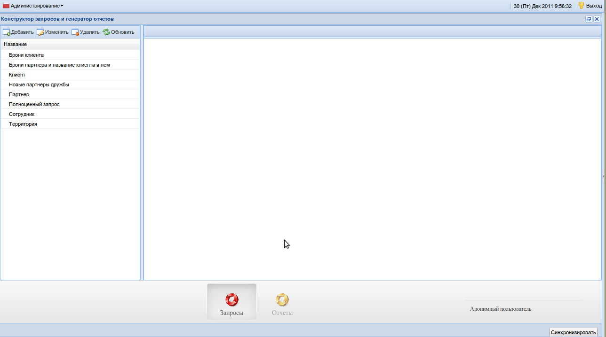
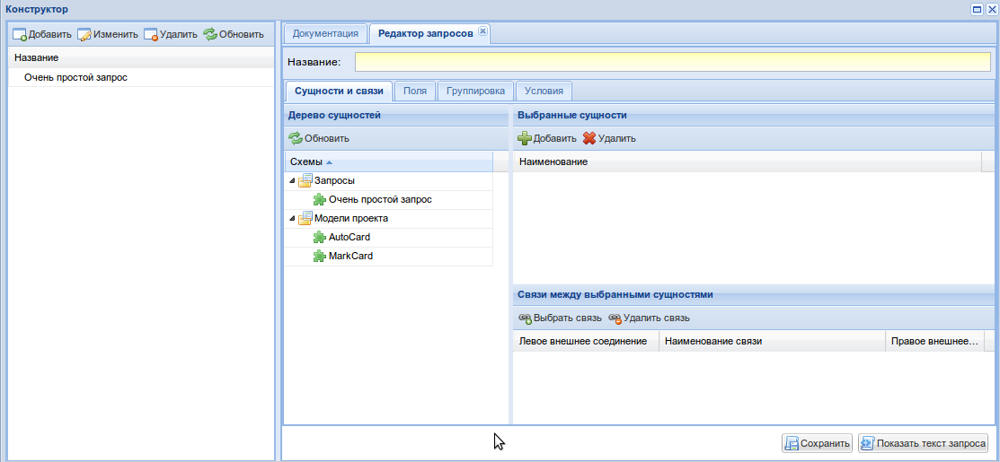
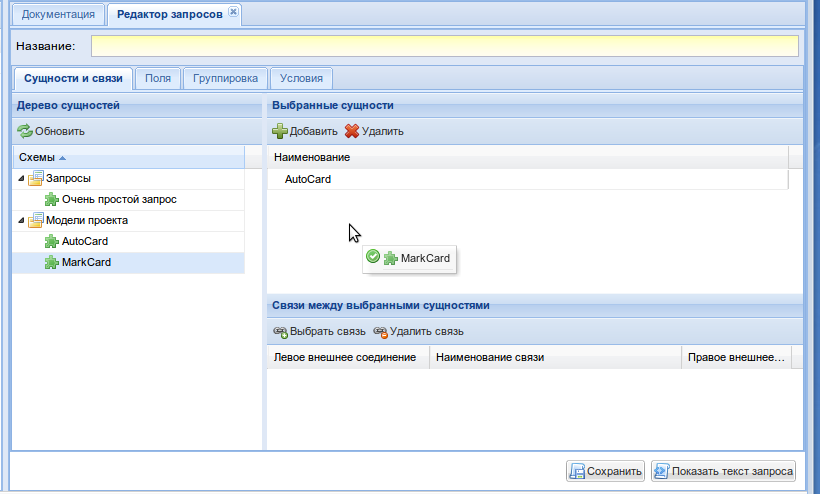
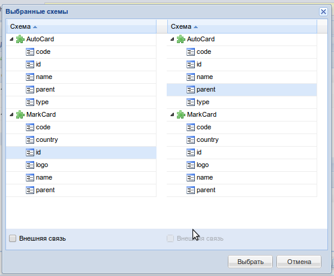
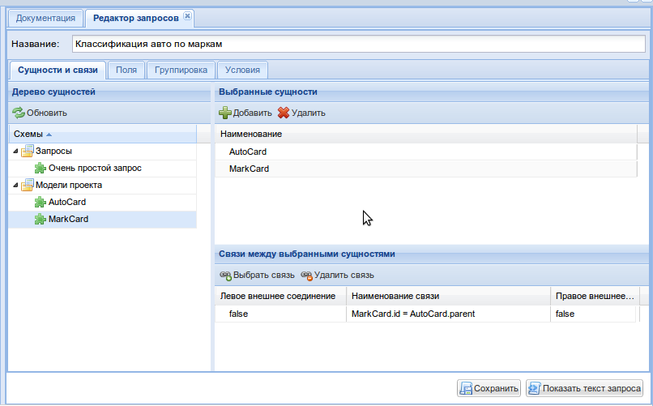
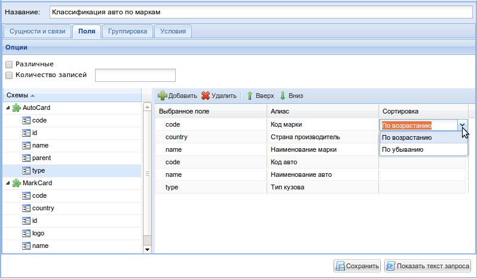
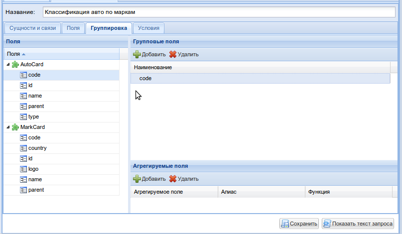
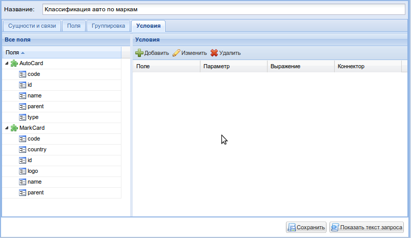
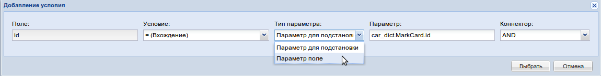
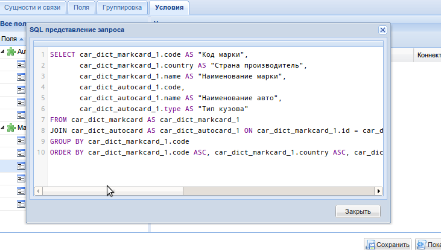

.. _user_query_builder:

Конструктор запросов
===================

Конструктор запросов позволяет динамически строить sql запрос с помощью
веб-интерфейса.

При открытии интерфейса КЗиО по умолчанию должна открыться
вкладка конструктора запросов. Чтобы быть уверенным, что вы находитесь на вкладке
конструктора запросов, убедитесь, что выделена вкладка "Запросы", как на рисунке
ниже

Создание, изменение и удаление запросов
"""""""""""""""""""""""""""""""""""""""

Для того, чтобы добавить запрос, нажмите на кнопку добавить в таблице слева.

Чтобы изменить запрос, два раза кликните по запросу в таблице, или выберите
запрос и нажмите на кнопку "Изменить".

Для удаления запроса, выберите запрос, и нажмите на кнопку "Удалить".

Для того, чтобы обновить данные в таблице запросов, нажмите на кнопку "Обновить".
Обновляйте таблицу после каждого добавления или изменения запроса, автоматически
этого не происходит.

Попробуем создать новый запрос.

Вкладка "Сущности и связи"
"""""""""""""""""""""""""""

При нажатии на кнопку "Добавить" таблицы запросов, на коллекции вкладок справа
должна появиться новая вкладка. Вот как она может выглядеть:

Подробнее разберем каждый элемент вкладки.

Слева, в "Дереве сущностей", находятся имеющиеся в проекте модели и уже созданные средствами
КЗиО запросы.

На основе сущностей строятся все запросы.

Попробуем добавить две сущности в наш запрос.

Выбираем сущность "*AutoCard*" и "*MarkCard*" и переносим их в
выбранные сущности. Эта, и многие прочие операции переноса и добавления поддерживают
Drag & Drop (зажатие кнопки мыши и перетаскивание).

После чего можно выбрать связь между сущностями щелкнув на кнопку
"*Выбрать связь*".

Свяжем авто с марками. Для этого на одной стороне нужно выбрать поле
"*id*" в cущности "MarkCard", а на другой стороне выбрать поле
"*parent*" в схеме "AutoCard". Ориентация сторон (левая, правая)
не имеет значения.

Добавим название к запросу: "*Классификация авто по маркам*".

Вот что мы получим:

Вкладка "Поля"
"""""""""""""""""""""""""""

На этой вкладке должны быть выбраны поля из выбранных ранее на первой вкладки сущностей.
Эти поля будут отображаться в select'e запроса. Так же имеется возможность задать сортировку
каждого поля по возрастанию, либо по убыванию и псевдоним.

Для того, чтобы учитывать поле в запросе, необходимо выбрать поле в дереве
"Схемы" слева, и либо нажать кнопку "Добавить", либо зажать поле, и перетащить
его в таблицу справа.

Чтобы указать сортировку, нужно два раза щелкнуть на поле "Сортировка" нужной
строки таблицы в таблице справа, после чего выбрать необходимое направление
из выпадающего списка, как на рисунке ниже:

Флаг "*Различные*" указывает на то, что повторяющиеся записи выбираться не будут,
аналогично ключевому слову ``DISTINCT`` в SQL.

Флаг "*Количество записей*" с числом указывает на то, что будет выбрано только
определенное количество записей, аналогично ключевому слову ``LIMIT`` в SQL.

Вкладка "Группировка"
"""""""""""""""""""""""""""

На этой вкладке могут быть выбраны поля для группировки и агрегирования.

Вкладка "Условия"
"""""""""""""""""""""""""""

На этой вкладке могут быть выбраны условия в запросе. Условия могут быть двух типов:
    1) Условие поля с параметром
    2) Условие поля с другим полем

Для того, чтобы добавить условие, нужно выбрать поле сущности в дереве "Все поля"
слева и нажать кнопку "Добавить", либо зажать поле и перетащить его в таблицу
"Условия" справа.

После этого появится окно:

В окне необходимо задать условие, тип параметра (обычный параметр или поле запроса), параметр и коннектор.

Как только вы выберете условие, и нажмете на кнопку "Выбрать", условие появится
в таблице.

Для того, чтобы увидеть текст построенного запроса необходимо нажать на кнопку "*Показать текст запроса*". Появится
окно с SQL кодом запроса.

Нажимаем "*Сохранить*" и убеждаемся, что запрос успешно сохранен.
Следующим шагом создадим отчет и привяжем его к вновь созданному запросу.

Документация по созданию отчетов находится :ref:`здесь <user_report_builder>`.