.. _user_report_builder:

Конструктор отчетов
===================

Генератор отчетов позволяет строить отчеты в виде электронных документов и таблиц
на основе запросов, созданных в конструкторе.

Чтобы быть уверенным, что вы находитесь на вкладке редактора запросов,
убедитесь, что выделена вкладка "Отчеты", как на рисунке ниже.

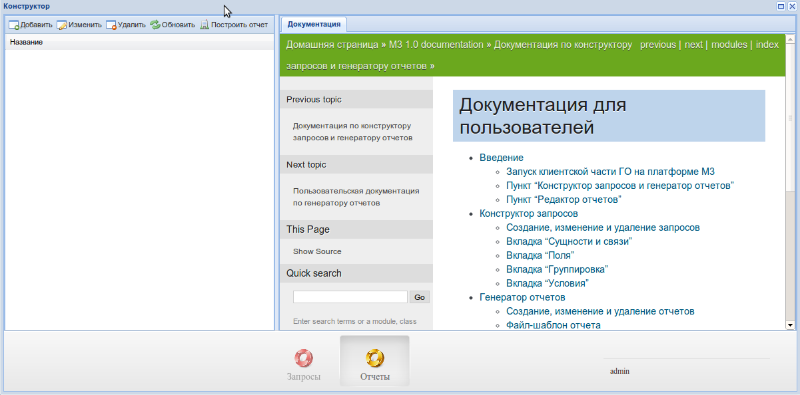

Создание, изменение и удаление отчетов
"""""""""""""""""""""""""""""""""""""""

Для того, чтобы добавить отчет, нажмите на кнопку добавить в таблице слева.

Чтобы изменить отчет, два раза кликните по отчету в таблице, или выберите
отчет и нажмите на кнопку "Изменить".

Для удаления отчета, выберите запрос, и нажмите на кнопку "Удалить".

Для того, чтобы обновить таблице отчетов, нажмите на кнопку "Обновить".
Обновляйте таблицу после каждого добавления или изменения отчета, автоматически
этого не происходит.

Для того, чтобы сформировать отчет, необходимо его выделить и нажать кнопку "*Построить отчет*"

Попробуем создать отчет, но перед этим разберемся с основными понятиями.

Файл-шаблон отчета
""""""""""""""""""

Отчеты всегда создаются на основе шаблона. Шаблон представляет из себя специально
оформленный электронный документ или электронную таблицу (представьте файлы, которыми
оперируют Microsoft Word и Microsoft Excel соответственно).

Документы и таблицы, кроме естественных различий, в понятиях генератора отчетов
разнятся еще и тем, что в документах нельзя задать секцию. Документ просто представляет
из себя одну большую секцию фиксированного типа.

Подробнее про составление файлов-шаблонов можно почитать :ref:`здесь <template_formation>`.

Понятие секции
""""""""""""""

Секция - это независимая часть документа, которую можно заполнить данными.

При создании отчета секции сопоставляются с полями запроса, этот процесс будет
подробнее рассмотрен далее. Сейчас же следует остановиться на том, в чем смысл секций.

Секция, как и запрос, также состоит из параметров.

При сопоставлении пользователь указывает соответствующему полю запроса
соответствующий параметр секции шаблона. Одной секции должен соответствовать лишь один запрос.

После успешного сопоставления, отчет сохраняется на сервере.

Когда пользователь получает готовый отчет, выполняется запрос к базе данных,
откуда берутся, собственно, данные. При этом данные подставляются в пользовательский
шаблон согласно сопоставлению секций с запросом.

Типы секций
+++++++++++++++++++++

**Важно**: в электронных документах нельзя задавать секции, они сами являются
одной большой секцией фиксированного типа с точки зрения генератора отчетов.
Все написанное далее в данном разделе имеет отношение только к электронным таблицам.

Секции делятся на две категории: горизонтальные и вертикальные.

Горизонтальные секции вставляют данные сразу же справа от предыдущей строки *этой же* секции.

Вертикальные секции вставляют данные сразу же снизу от предыдущего столбца *этой же* секции.

В свою очередь, разные секции, какого бы типа они не были, всегда вставляют данные
прямо ниже предыдущей секции.

**Важно**: Как бы не был сформирован шаблон, секции всегда начинают вставляться
строго с верхней левой секции, потому что порядок секций определяется не шаблоном,
а пользователем.

Иерархия секций
++++++++++++++++

Секции в электронных таблицах могут быть организованы в иерархию. Поясним необходимость этого на примере.
Допустим имеется таблица "*Master*" и "*Child*". Необходимо составить отчет, в котором будет представлена
таблица в которую выводится первая запись из таблицы "*Master*" и все связанные с ней записи из таблицы
"*Child*". Далее вторая запись из таблицы "*Master*" и все связанные с ней записи из дочерней таблицы и т.д.
Для решения этой проблемы секции организовываются в иерархию.

Создание нового отчета
""""""""""""""""""""""""""

После нажатия кнопки "Добавить" на таблице слева, справа должна открыться вкладка
со следующим содержанием:

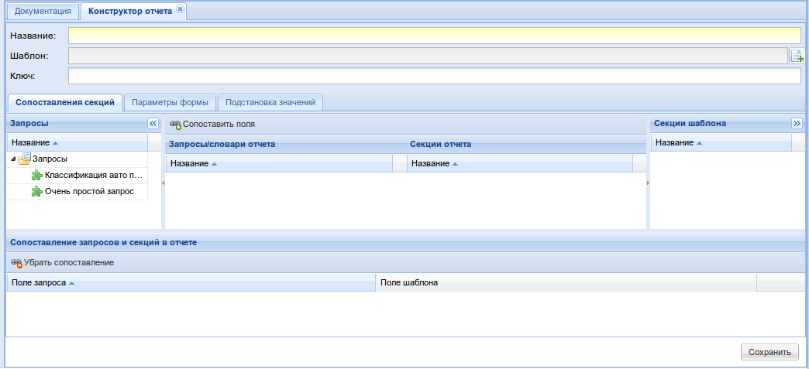

Назовем наш отчет "Классификация авто по маркам" и добавим шаблон.

Поле "Ключ", содержит значение, которое однозначно идентифицирует запрос.
Пользователь может самостоятельно задать ключ и ему не нужно будет знать идентификатор
отчета в БД. Данное поле активно лишь при создании отчета. При редактировании оно будет неактивно.
Для того, чтобы поменять значение поля "Ключ" при редактировании отчета, необходимо нажать комбинацию
клавиш "*ctrl-shift-m*".

Шаблон можно взять :download:`здесь <../downloads/test.xlsx>`.

Поле "Шаблон" указывает на шаблон, используемый в отчете. После того, как шаблон
прикреплен к отчету, есть возможность перезалить его. Также имеется возможность скачать
шаблон (например для внесения исправлений)

После прикрепления шаблона должно обновиться дерево "Секции шаблона":

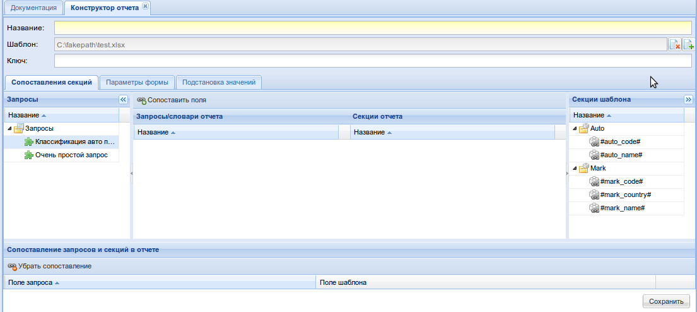

Перетащим из дерева "Запросы" запрос "Классификация авто по маркам"

Мы увидим как во внутреннем дереве "Запросы отчета" появятся запрос
вместе со своими полями.

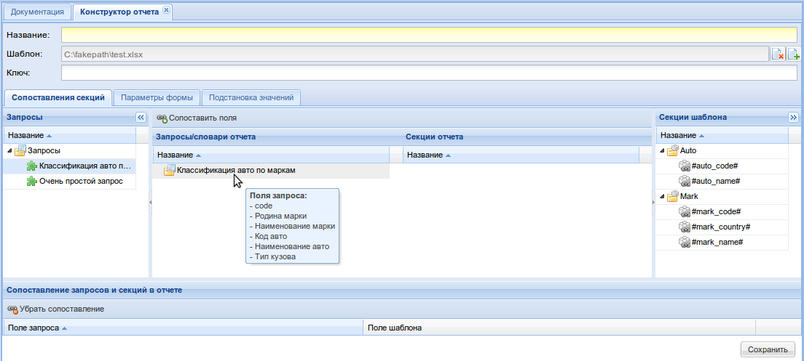

Теперь перетащим секцию "Mark" из дерева "Секции шаблона" в дерево "Секции отчета".
Должно появиться следующее окно:

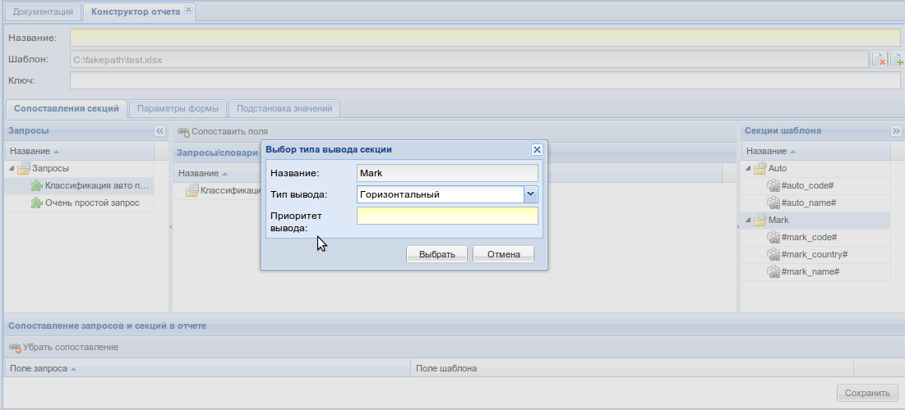

Здесь, кроме названия секции и типа вывода будет так же поле "Приоритет вывода"
Оно отвечает за порядок вывода секций в конечном отчете, так как он может отличаться от
порядка в шаблоне. Меньшие цифры означают более высокий приоритет.

Укажем в качестве типа вывода "Вертикальный", а в качестве приоритета 1.

После добавления секции "Mark" добавим еще и секцию "Auto"(внутрь секции "Mark"), однако в качестве
типа вывода выберем "Вертикальный", а в качестве приоритета выставим 2.

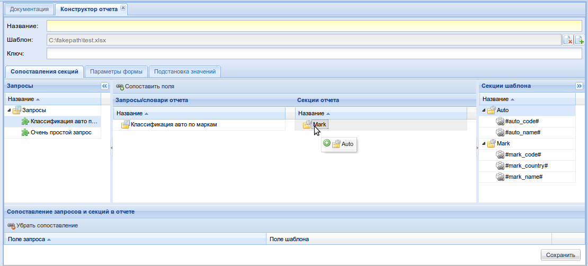

Мы должны увидеть следующую картину:

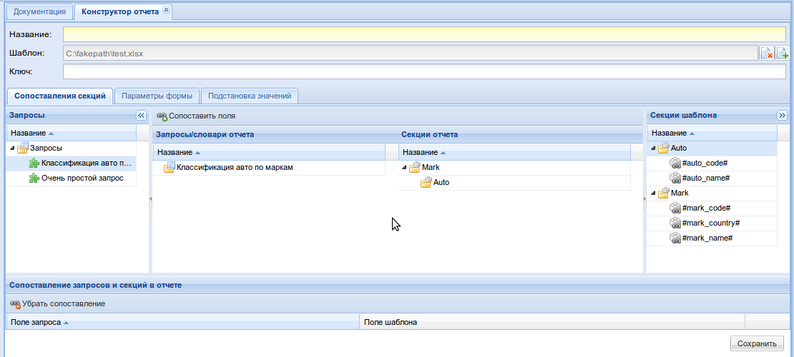

Теперь сопоставим поля запросов и секции отчета. Заполненные поля выполненных
запросов попадут в конечный отчет в соответствии с сопоставлением.

Выберем в дереве "Запросы отчета" запрос "Классификация авто по маркам", а в дереве
"Секции отчета" секцию "Mark" и нажмем кнопку "Сопоставить поля". Мы должны увидеть:

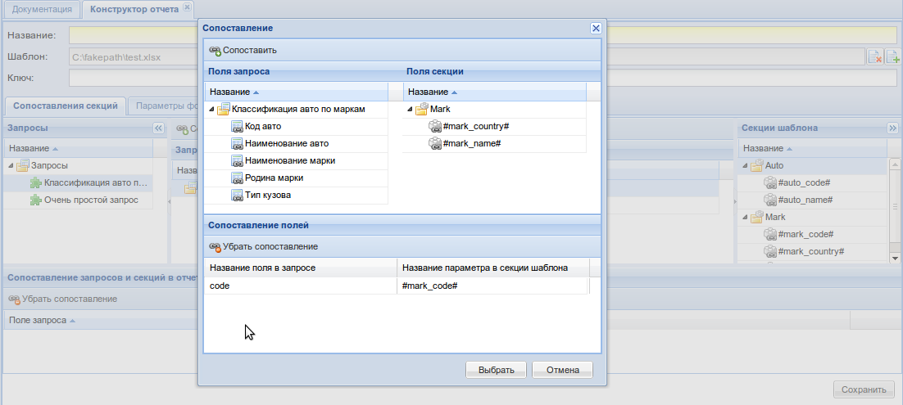

Нажимая на кнопку "Сопоставить" последовательно сопоставим поле запроса "code"
с полем секции "#mark_code#", "Наименование марки" с "#mark_name#",
а "Родина марки" с "#mark_country#", и нажмем кнопку "Выбрать".

Далее сопоставим оставшиеся поля запроса "Классификация авто по маркам" с секцией "Auto".

Теперь осталось лишь сопоставить параметры условий запросов с параметрами, которые
может заполнить пользователь. Для этого нам нужно переключиться на вкладку
"Параметры формы". В отчете отсутствуют параметры и поэтому мы увидим

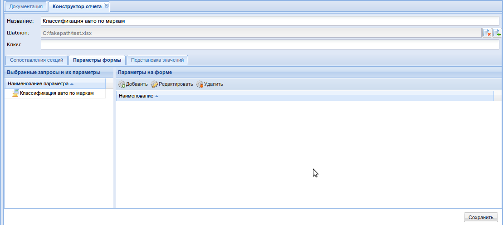

При наличие в запросе параметров, необходимо выделить их и нажать кнопку "Добавить". После
чего, появится диалоговое окно создания поля-параметра. Поля-параметры содержат
внутри себя параметры, которые должны быть равны при запросе. При создание поля параметра
необходимо указать его имя, выбрать тип(в зависимости от типа доступны настройки значения по умолчанию),
обязательность параметра.

На вкладке "Подстановка значений" можно задать возможность заменить значения полученные
в запросе на необходимые нам. Поясним на примере. Допустим необходимо вывести в отчет тип кузова автомобиля.
Однако в БД хранятся лишь коды кузовов(1-универсал, 2-хэтчбек и т.д.). Но в отчет необходимо вывести именно
строковое представления типа кузова. Эту возможность реализует механизм подстановки значений. Для того,
чтобы воспользоваться этим механизмом необходимо выделить поле, которое необходимо заменить и добавить в
таблицу "Подстановка параметров запроса". После добавления всплывет диалоговое окно:

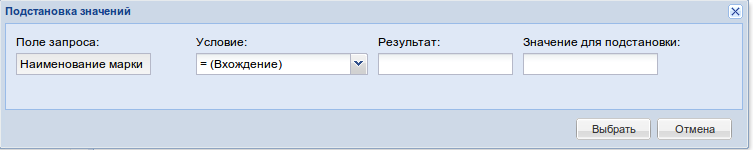

После того, как шаблон готов, необходимо его сохранить. После сохранения можно сформировать отчет. Для
этого выделяем его и жмем на кнопку "Построить отчет". Всплывет окно с двумя вкладками: "Параметры запроса"
и "Дополнительные опции".

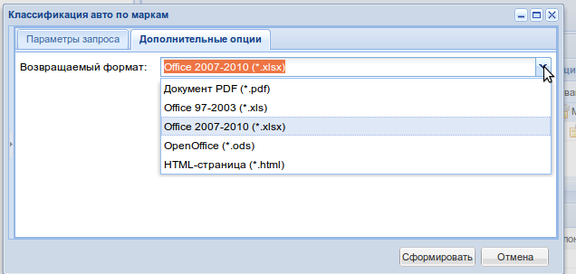

На первой вкладке появятся поля-параметры, а на второй поле для выбора формата отчета.

После того, как поля-параметры заполнены и выбран формат отчета нажимаем кнопку сформировать.
В результате всплывет диалоговое окно, предлагающее скачать файл с отчетом.
