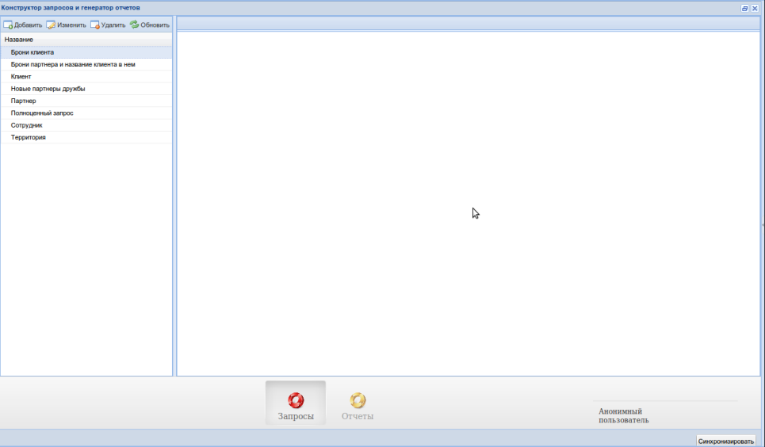
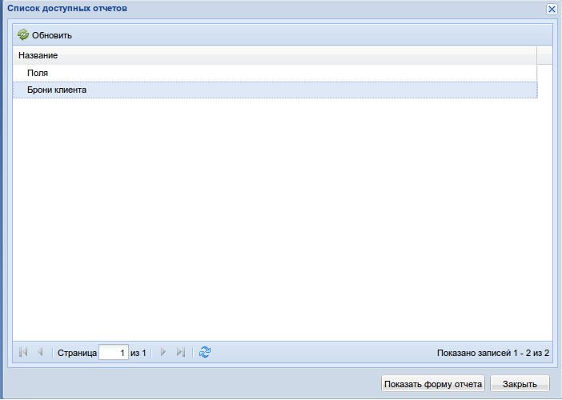
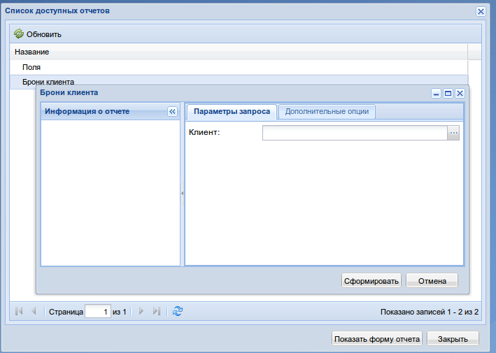
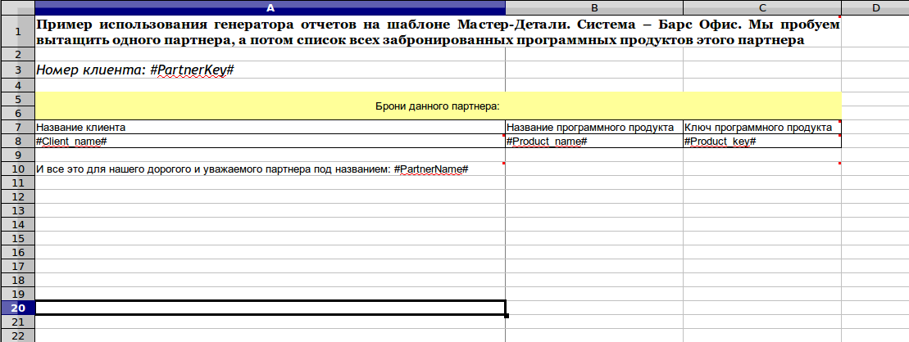
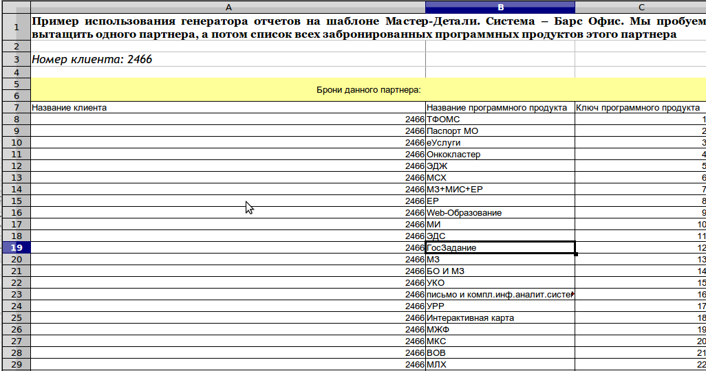

.. _user_report_editor:

Клиентское приложение генератора отчетов для платформы М3
=========================================================

Клиентское приложение отвечает за отправку метаданных на сервер, за генерацию
форм с параметрами, и за получение отчетов.

Отправление метаданных и синхронизация
""""""""""""""""""""""""""""""""""""""

Отправление метаданных происходит как только выбран пункт меню "Конструктор
запросов и генератор отчетов".

Для синхронизации созданных отчетов на сервере с клиентом необходимо нажать
кнопку "Синхронизация" (внизу на рисунке):

Список доступных отчетов
""""""""""""""""""""""""

Для того, чтобы увидеть список отчетов доступных для получения, нужно выбрать
пункт меню "Редактор отчетов":

Выберем пункт "Брони клиента", дважды кликнув по нему, или нажав на кнопку
"Показать форму отчета". Увидим:

Поле "Клиент" соответствует тому самому полю, которое мы описали в
:ref:`документации по генератору отчетов <user_report_generation>`.

Заполнив его, и нажав на кнопку "Сформировать", мы получим отчет.

Для его заполнения система предложит нам выбор из справочника клиентов, так как
мы сослались на этот справочник в процессе описания поля в генераторе отчетов.

Выберем клиента и на вкладке "Дополнительные опции" выберем в качестве
возвращаемого формата "Электронная таблица Office 2007-2010".

Нажимаем на кнопку сформировать, и получим отчет.

У нас был шаблон такого вида:

А стал такого:

