.. _user_report_generation:

Генератор отчетов
===================

Генератор отчетов позволяет строить отчеты в виде электронных документов и таблиц
на основе запросов, созданных в конструкторе.

Чтобы быть уверенным, что вы находитесь на вкладке редактора запросов,
убедитесь, что выделена вкладка "Отчеты", как на рисунке ниже.

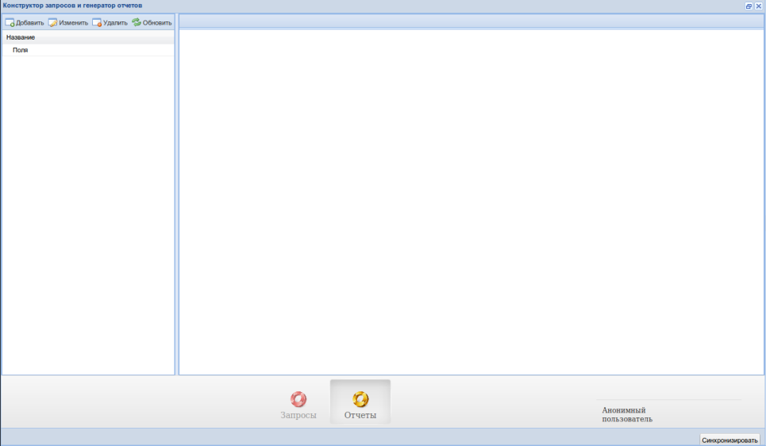

Создание, изменение и удаление отчетов
"""""""""""""""""""""""""""""""""""""""

Для того, чтобы добавить отчет, нажмите на кнопку добавить в таблице слева.

Чтобы изменить отчет, два раза кликните по отчету в таблице, или выберите
отчет и нажмите на кнопку "Изменить".

Для удаления отчета, выберите запрос, и нажмите на кнопку "Удалить".

Для того, чтобы обновить таблице отчетов, нажмите на кнопку "Обновить".
Обновляйте таблицу после каждого добавления или изменения отчета, автоматически
этого не происходит.

Попробуем создать отчет, но перед этим разберемся с основными понятиями.

Файл-шаблон отчета
""""""""""""""""""

Отчеты всегда создаются на основе шаблона. Шаблон представляет из себя специально
оформленный электронный документ или электронную таблицу (представьте файлы, которыми
оперируют Microsoft Word и Microsoft Excel соответственно).

Документы и таблицы, кроме естественных различий, в понятиях генератора отчетов
разнятся еще и тем, что в документах нельзя задать секцию. Документ просто представляет
из себя одну большую секцию фиксированного типа.

Подробнее про составление файлов-шаблонов можно почитать :ref:`здесь <template_formation>`.

Понятие секции
""""""""""""""

Секция - это независимая часть документа, которую можно заполнить данными.

При создании отчета секции сопоставляются с полями запроса, этот процесс будет
подробнее рассмотрен далее. Сейчас же следует остановиться на том, в чем смысл секций.

Секция, как и запрос, также состоит из параметров.

При сопоставлении пользователь указывает соответствующему полю запроса
соответствующий параметр секции шаблона. Обычно одному параметру *запроса*
соответствует один параметр *секции*, но это **не обязательно**.

После успешного сопоставления, отчет сохраняется на сервере.

Когда пользователь получает готовый отчет, выполняется запрос к базе данных,
откуда берутся, собственно, данные. При этом данные подставляются в пользовательский
шаблон согласно сопоставлению секций с запросом.

Типы секций
+++++++++++++++++++++

Секции бывают двух типов: фиксированные и гибкие.

В фиксированные секции данные можно вставить только один раз. Фиксированные
секции могут работать только с типом запросов "словарь" (такой тип запросов
помечен галочкой "получать объект").

В гибкие секции можно повторно вставить отформатированные данные. Гибкие секции
работают только с обычным типом запросов, таких, что галочка "получать объект"
для них не была указана.

**Важно**: в электронных документах нельзя задавать секции, они сами являются
одной большой секцией фиксированного типа с точки зрения генератора отчетов.
Все написанное далее в данном разделе имеет отношение только к электронным таблицам.

Гибкие секции в свою очередь также делятся на две категории: горизонтальные и вертикальные.

Горизонтальные секции вставляют данные сразу же справа от предыдущей строки *этой же* секции.

Вертикальные секции вставляют данные сразу же снизу от предыдущего столбца *этой же* секции.

В свою очередь, разные секции, какого бы типа они не были, всегда вставляют данные
прямо ниже предыдущей секции.

**Важно**: Как бы не был сформирован шаблон, секции всегда начинают вставляться
строго с верхней левой секции, потому что порядок секций определяется не шаблоном,
а пользователем.

Запросы и словари
"""""""""""""""""""

Разница между словарями и запросами такова, что словари всегда возвращают лишь
первый соответствующий условию объект из выборки, в то время как запросы
возвращают всю выборку.

Таким образом, словарь это один объект, а запрос это множество объектов.

По умолчанию все запросы словарями не являются. Чтобы получать словарь вместо запроса,
необходимо проставить галочку "Получать объект" в конструкторе запросов.

Создание нового отчета
""""""""""""""""""""""""""

После нажатия кнопки "Добавить" на таблице слева, справа должна открыться вкладка
со следующим содержанием:

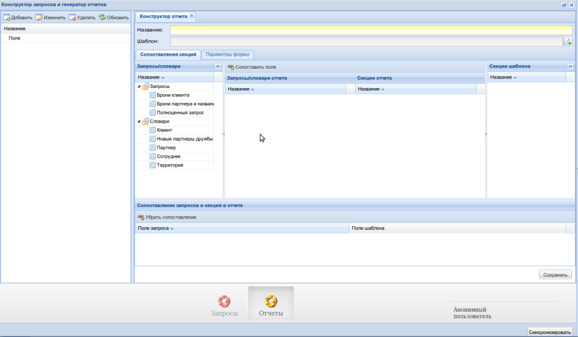

Назовем наш отчет "Брони клиента" и добавим шаблон.

Шаблон можно взять :download:`здесь <../downloads/bars_office_test_2.xlsx>`.

После прикрепления шаблона должно обновиться дерево "Секции шаблона":

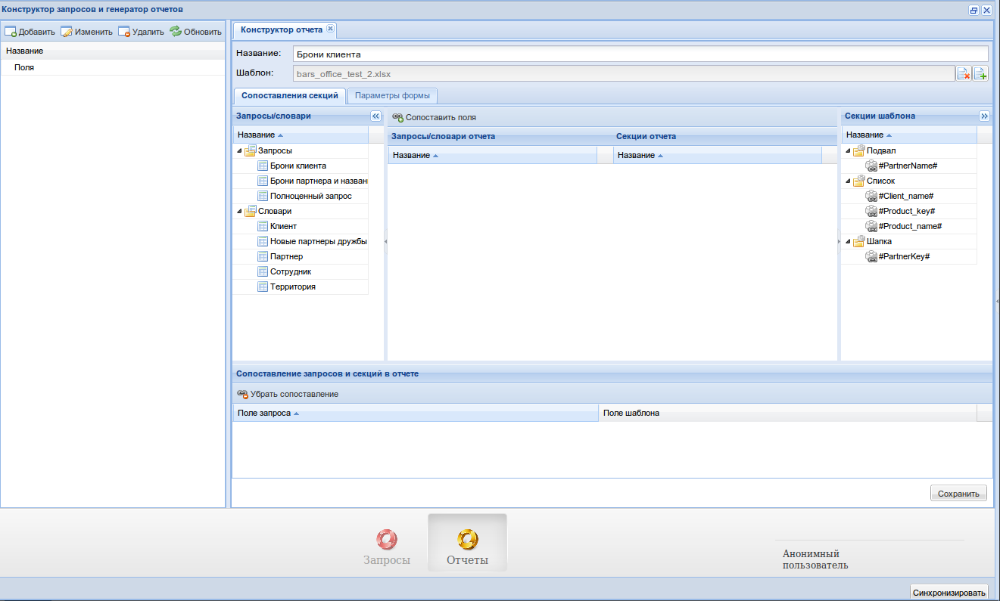

Перетащим из дерева "Запросы/словари" запрос "Брони клиента" и словарь "Клиент".

(Словарь "Клиент" состоит лишь из сущности "Клиент" и всех ее полей, и условия
client_id = 'param'.)

Мы увидим как во внутреннем дереве "Запросы/словари отчета" появятся запросы
вместе со своими полями.

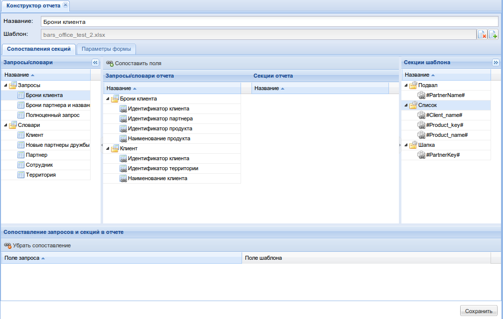

Теперь перетащим секцию "Шапка" из дерева "Секции шаблона" в дерево "Секции отчета".
Должно появиться следующее окно:

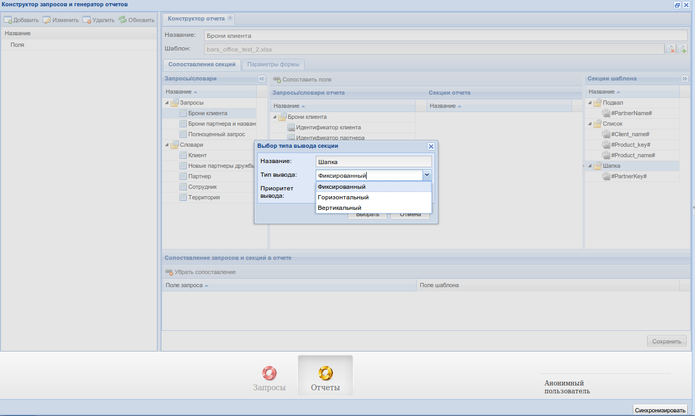

Здесь, кроме названия секции и типа вывода будет так же поле "Приоритет вывода"
Оно отвечает за порядок вывода секций в конечном отчете, так как он может отличаться от
порядка в шаблоне. Меньшие цифры означают более высокий приоритет.

Укажем в качестве типа вывода "Фиксированный", а в качестве приоритета 1.

После добавления секции "Шапка" добавим еще и секцию "Список", однако в качестве
типа вывода выберем "Вертикальный", а в качестве приоритета выставим 2.

Последней добавим секцию "Подвал" с фиксированным типом вывода и приоритетом 3.

Мы должны увидеть следующую картину:

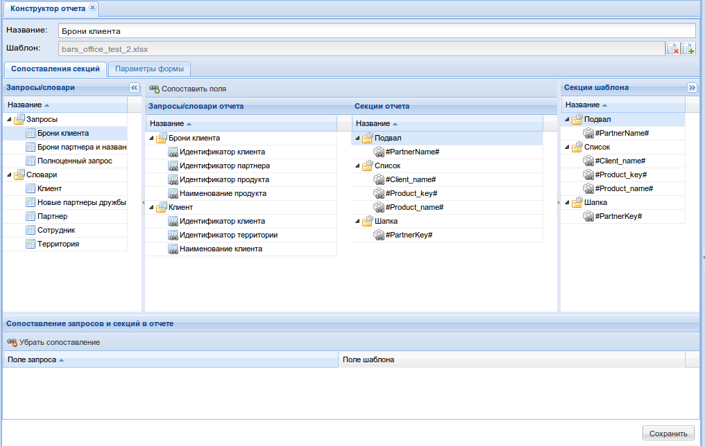

Теперь сопоставим поля запросов и секции отчета. Заполненные поля выполненных
запросов попадут в конечный отчет в соответствии с сопоставлением.

**Важно**: словари следует сопоставлять только с фиксированными секциями, а
запросы только с гибкими.

Выберем в дереве "Запросы/словари отчета" запрос "Брони клиента" (сам запрос,
а не его поля), а в дереве "Секции отчета" секцию "Список" и нажмем кнопку
"Сопоставить поля". Мы должны увидеть:

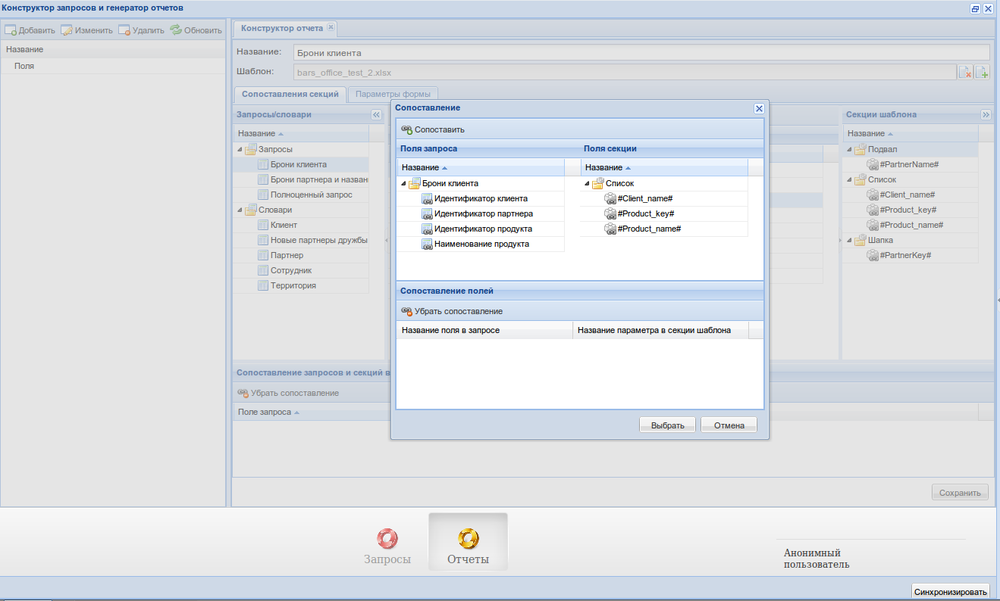

Нажимая на кнопку "Сопоставить" последовательно сопоставим поле запроса "Идентификатор
продукта" с полем секции "#Product_key#", "Наименование продукта" с "#Product_name#",
а "Идентификатор клиента" с "#Client_name#", и нажмем кнопку "Выбрать".

Далее сопоставим какие угодно поля словаря "Клиент" с секциями "Подвал" и "Шапка".
Получим, например:

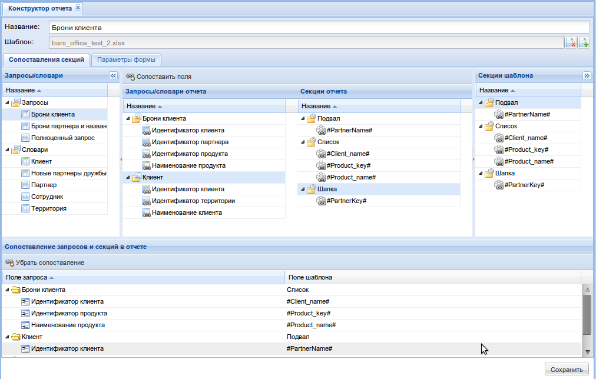

Теперь осталось лишь сопоставить параметры условий запросов с параметрами, которые
может заполнить пользователь. Для этого нам нужно переключиться на вкладку
"Параметры формы". Мы увидим:

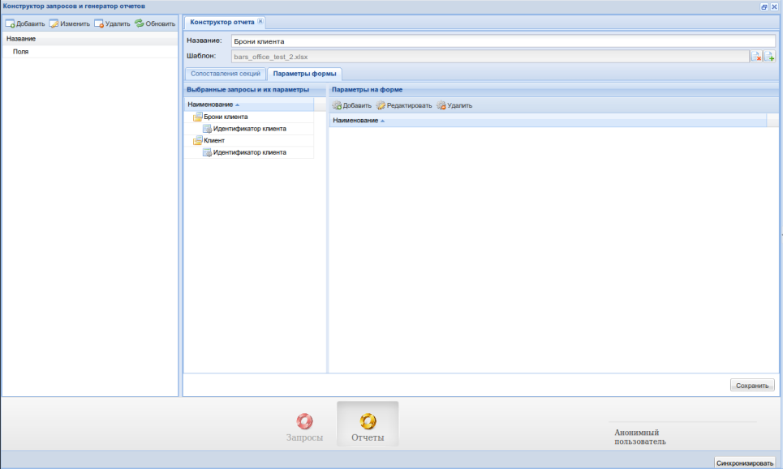

На этой вкладке можно создавать параметры для формы, которую должен будет
заполнить пользователь перед тем, как получить отчет. Таким образом пользователь
предоставит необходимые параметры для запросов.

Так как параметры условий обоих наших запросов совпадают(нам нужно получить
идентификатор клиента), то их следует привязать к одному полю. Для этого в первую
очередь нужно добавить любой из параметров, выбрав его в дереве "Выбранные
запросы и их параметры", и нажав на кнопку "Добавить":

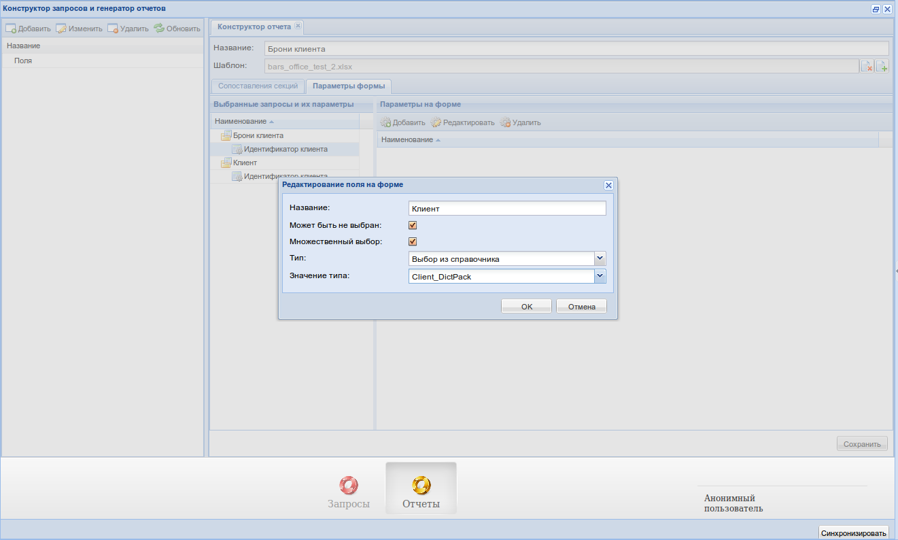

Назовем наш параметр "Клиент". Укажем ему тип "Выбор из справочника", и в появившемся
выпадающем поле выберем справочник прикладной системы, соответствующий клиентам.

Далее, чтобы не создавать еще одно такое же поле "Клиент" на форме прикладной
системы, нам нужно лишь зажать оставшийся параметр в дереве "Выбранные запросы и
их параметры" мышью и перетащить прямо **на** новосозданный параметр
в дереве "Параметры на форме":

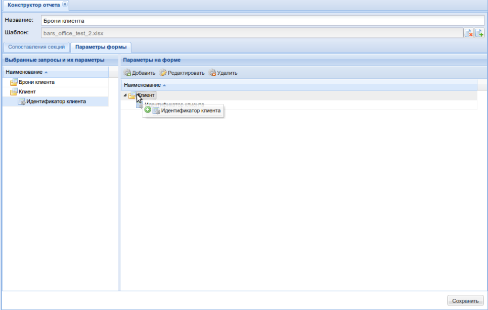

Должно получиться:

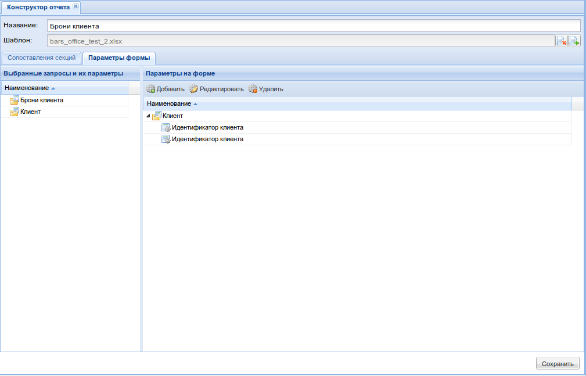

Теперь нажмем на кнопку "Сохранить", и наш отчет должен быть сохранен.

Попробуем получить новосозданный отчет вместе с данными на стороне клиента. Как
это сделать описано :ref:`здесь <user_report_editor>`.