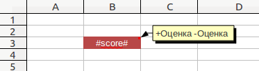

.. _template_formation:

Создание шаблонов для генератора отчетов
===================================================

Принципы работы
---------------

Работа генератора отчетов основана на заполнении данными специально сформированных
документов, называемых шаблонами.

Допустимые форматы шаблонов для отчетов-документов: .doc и .odt.

Допустимые форматы шаблонов для отчетов-электронных таблиц: .xls и .ods.

Отчеты в виде текстовых документов
----------------------------------

Возможности
+++++++++++

1. Построение отчета на основе шаблона в формате .doc и .odt.

2. Подстановка строк с сохранением форматирования. 
	Для подстановки значения в переменную существует тег **#variable#**.
	Для сохранения форматирования при подстановке значения переменной теги
	также должны быть отформатированы.

3. Экспорт в форматы, поддерживаемые OpenOffice (doc, odt, pdf, html, txt, итд).

4. Сохранение картинок и их расположения в документе отчета. 
	Картинки, добавленные в файл шаблона, сохраняются в результирующем файле.

Примеры использования
+++++++++++++++++++++

Шаблон:

.. image:: ../images/user/doc_template.png

Возможный результат:

.. image:: ../images/user/doc_result.png

Отчеты в виде электронных таблиц
--------------------------------

В основе принципа построения отчета-электронной таблицы лежит понятие секции. 

**Секция** — это именованная область таблицы, предназначенная для многократного
вывода. Секция задается своими верхней левой и нижней правой ячейками.

Чтобы задать секцию с именем Шапка, необходимо:
	* Добавить в комментарий левой верхней ячейки текст +Шапка
	* Добавить в комментарий правой нижней ячейки текст -Шапка 

.. image:: ../images/user/header.png

Пример: выделенная серым цветом область ячеек принадлежит секции с названием
Шапка.

Секции могут пересекаться:

.. image:: ../images/user/cross_sections.png

В одной ячейке можно задавать несколько границ секций, названия секций должны
быть разделены пробелом:

Секции должны быть заданы в первом листе шаблона. Название секции является
регистрозависимым.

Возможности
+++++++++++

1. Построение отчета на основе шаблона в формате .xls и .ods.

2. Подстановка строк, дат и чисел в ячейки с сохранением форматирования. 
	Для подстановки значения в переменную существует тег **#variable#**.
	Для сохранения форматирования при подстановке значения переменной
	теги также должны быть отформатированы. Формат отображения даты задается
	установкой необходимого формата даты в свойствах ячейки электронной таблицы.
	Формат отображения чисел также задается установкой свойств ячейки.

3. Подстановка нескольких значений в ячейку. 
	В одной ячейке может содержаться и обычный текст, и произвольное количество
	переменных.

	Пример:

	.. image:: ../images/user/text_with_vars.png

4. Экспорт в форматы, поддерживаемые OpenOffice (xls, ods, pdf, html итд).

5. Сохранение высоты строк и перенос по словам.
	Для того, чтобы высота строки изменялась в зависимости от содержимого ячейки,
	необходимо в файле шаблона в свойствах ячейки указать «Переносить по словам»,
	и в любую пустую ячейку строки добавить тег *<optimal height>*.

	При этом нужно учитывать, что, если в одной строке было выведено несколько
	ячеек с разными значениями высоты, то в результате высота строки будет
	соответствовать значению высоты в первой выведенной в строке ячейке.

	Пример:

	.. image:: ../images/user/optimal_height.png

6. Сохранение ширины столбцов.
	Если в одном столбце было выведено несколько ячеек с разными значениями
	ширины,   в результате ширина столбца будет соответствовать значению ширины
	в первой выведенной в столбце ячейке.

7. Вывод секции в заданную ячейку.
	По умолчанию секции выводятся правее (при выводе горизонтально) или ниже
	(при выводе вертикально) предыдущих выведенных секций.

8. Вставка в отчет разрыва страницы.
	Для вставки в отчет разрыва необходимо добавить в файл шаблона разрыв,
	пересекающий секцию. При выводе секции, в которой содержится разрыв,
	положение разрыва относительно секции сохранится. Разрывы, расположенные
	на границе секции, также считаются входящими в секцию.

	Пример:

	.. image:: ../images/user/page_breaks.png

	В данном примере шаблон содержит разрыв по нижней границе строки с номером
	11. В результате в отчет будет вставлен разрыв страницы в конце каждой
	секции "Информация".

Примеры использования
+++++++++++++++++++++

1) Шаблон:

.. image:: ../images/user/excel_simple_template.png

Возможный результат:

.. image:: ../images/user/excel_simple_result.png

2) Шаблон:

.. image:: ../images/user/excel_complex_template.png

Возможный результат:

.. image:: ../images/user/excel_complex_result.png
