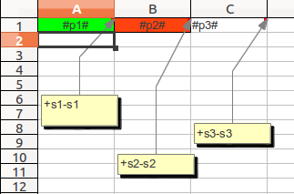

.. _report_generation:

Генератор отчетов (simple_report)
===================================================

Краткое описание
----------------------

Модуль simple_report позволяет разработчику составлять отчеты формата OpenXML(DOCX, XLSX) и формата XLS. Модуль позволяет
на основе шаблона составленного по определенным правилам и скрипта составить желаемый отчет.

Отчеты в виде текстовых документов
----------------------------------

Возможности
+++++++++++

1. Построение отчета на основе шаблона в формате .docx.

2. Подстановка строк с сохранением форматирования. 
	Для подстановки значения в переменную существует тег **#variable#**. Однако существует проблема связанная с тем, что Word сохраняет **#variable#** не как одну строку,
	а воспринимает символ экранирования **#** и имя параметра **variable** как отдельные строки. Чтобы избежать данной трудности можно просто использовать имя параметра
	**variable**.
	Для сохранения форматирования при подстановке значения переменной теги также должны быть отформатированы.

3. Наличие конвертера и возможности конвертации.

4. Поддержка вывода параметров в фигуры (прямоугольники, круги и т.д.).

Примеры использования
+++++++++++++++++++++

Шаблон:

.. image:: images/report_generation/doc_template.png

Код программы::

	report = DocumentReport(template_path) 
	params = {'employee_name':employee_name, 'employee_post':employee_post} 
	params['job_place'] = job_place 
	params['begin_date'] = begin_date 
	params['end_date'] = end_date 
	params['salary'] = salary 
	params['signature_post'] = signature_post 
	report.build(document_file, params)

Результат:

.. image:: images/report_generation/doc_result.png

Отчеты в виде электронных таблиц
--------------------------------

В основе принципа построения отчета-электронной таблицы лежит понятие секции. 

**Секция** — это именованная область таблицы, предназначенная для многократного вывода. Секция задается своими верхней левой и нижней правой ячейками. 

Чтобы задать секцию с именем Шапка, необходимо:
	* Добавить в комментарий левой верхней ячейки текст +Шапка
	* Добавить в комментарий правой нижней ячейки текст -Шапка 

.. image:: images/report_generation/header.png

Пример: выделенная серым цветом область ячеек принадлежит секции с названием Шапка.

Секции могут пересекаться :

.. image:: images/report_generation/cross_sections.png

В одной ячейке можно задавать несколько границ секций, названия секций должны быть разделены пробелом:

.. image:: images/report_generation/score.png

Секции должны быть заданы в первом листе шаблона. Название секции является регистрозависимым. 

Возможности
+++++++++++

1. Построение отчета на основе шаблона в формате .xls и .xlsx.

2. Подстановка строк, дат и чисел в ячейки с сохранением форматирования. 
	Для подстановки значения в переменную существует тег **#variable#**. Для сохранения форматирования при подстановке значения переменной теги также должны быть отформатированы. Формат отображения даты задается установкой необходимого формата даты в свойствах ячейки электронной таблицы. Формат отображения чисел также задается установкой свойств ячейки. 

3. Подстановка нескольких значений в ячейку. 
	В одной ячейке может содержаться и обычный текст, и произвольное количество переменных.

	Пример:

	.. image:: images/report_generation/text_with_vars.png

4. Вывод секций в горизонтальном направлении.
	Для того, чтобы вывести секцию горизонтально, необходимо при вызове метода секции flush указать значение параметра oriented=ISpreadsheetSection.HORIZONTAL. Секция будет напечатана справа от последней выведенной секции.

	.. image:: images/report_generation/horizontal-orientation.png

5. Вывод секции в направлении вверх-вправо.
    Для того, чтобы вывести секция в направлении вверх-вправо, необходимо при вызове метода flush указать значение параметра oriented=ISpreadsheet.RIGHT_UP. Секция будет напечатана с верхнего края листа, правее ранее выведенной секции.

    .. image:: images/report_generation/right_up-orientation.png

6. Вывод секций в вертикальном направлении.
	Для того, чтобы вывести секцию вертикально, необходимо при вызове метода секции flush указать значение параметра oriented=ISpreadsheetSection.VERTICAL. Секция будет напечатана снизу от последней выведенной секции.

    .. image:: images/report_generation/vertical-orientation.png

7. Вывод секций в направлении влево-вниз.
    Для того, чтобы вывести секцию в направлении влево-вниз, необходимо при вызове метода секции flush указать значение параметра oriented=ISpreadsheetSection.LEFT_DOWN (данное значение используется по-умолчанию). Секция будет напечатана с левого края листа, ниже ранее выведенных секций.

    .. image:: images/report_generation/left_down-orientation.png

8. Наличие конвертера и возможности конвертации.
9. Сохранение высоты строк и перенос по словам.
	Для того, чтобы высота строки изменялась в зависимости от содержимого ячейки, необходимо в файле шаблона в свойствах ячейки указать «Переносить по словам», и в любую пустую ячейку строки добавить тег *<optimal height>*.
	При этом нужно учитывать, что, если в одной строке было выведено несколько ячеек с разными значениями высоты, то в результате высота строки будет соответствовать значению высоты в первой выведенной в строке ячейке.

	Пример:

	.. image:: images/report_generation/optimal_height.png

10. Сохранение ширины столбцов.
	Если в одном столбце было выведено несколько ячеек с разными значениями ширины,   в результате ширина столбца будет соответствовать значению ширины в первой выведенной в столбце ячейке.

11. Перенос формул.
    Если в секции присутствует формула, то при каждом последующем выводе она будет видоизменяться в зависимости от места её
    вывода.

12. Вывод иерархических секций (обьединение ячеек).

Примеры использования
+++++++++++++++++++++

1) Шаблон:

.. image:: images/report_generation/excel_simple_template.png

Код программы для шаблона формата xlsx::

	report = SpreadsheetReport(temp_path)
	header = report.get_section(u'Шапка')
	section = report.get_section(u'Строка') 
	header.flush({'user':user.username,'start_date':context.start_date,'end_date':context.end_date})

	for (num, reminder) in enumerate(reminders):
	    row_dicionary = {'num':num+1, 'call_date':reminder.date, 'client_name':reminder.call.contragent.name()}
	    dic['territory'] = client.territory.name
	    dic['product'] = reminder.call.product.name
	    dic['call_subject'] = reminder.call.subject
	    section.flush(dic)

	report.build(xlsx_file_path)

Этот же пример для формата xls::

    report = SpreadsheetReport(temp_path, wrapper=DocumentXLS, type=FileConverter.XLS)
    header = report.get_section(u'Шапка')
   	section = report.get_section(u'Строка')
   	header.flush({'user':user.username,'start_date':context.start_date,'end_date':context.end_date})

   	for (num, reminder) in enumerate(reminders):
   	    row_dicionary = {'num':num+1, 'call_date':reminder.date, 'client_name':reminder.call.contragent.name()}
   	    dic['territory'] = client.territory.name
   	    dic['product'] = reminder.call.product.name
   	    dic['call_subject'] = reminder.call.subject
   	    section.flush(dic)

   	report.build(xls_file_path)

Результат:

.. image:: images/report_generation/excel_simple_result.png

2) Шаблон:

.. image:: images/report_generation/excel_complex_template.png

Код программы для шаблона формата xlsx::

	report = SpreadsheetReport(temp_path)
	header = report.get_section(u'Шапка')
	section = report.get_section(u'Строка')
	sum = report.get_section(u'Сумма')
	subject_header = report.get_section(u'Предмет_заголовок')
	score = report.get_section(u'Оценка') 
	header.flush({'date':datetime.datetime.now(),'class':u'5Б'}, oriented=ISpreadsheetSection.HORIZONTAL)
	subject_header.flush({'subject_h':u'Математика'},oriented=ISpreadsheetSection.HORIZONTAL)
	subject_header.flush({'subject_h':u'Русский язык'})

	for (num, student) in enumerate(students):
    	    params = {'num':num + 1 , 'iname':student['iname'], 'fname':student['fname'], 'birth_date':student['birth_date']}
    	    section.flush(params, oriented=ISpreadsheetSection.HORIZONTAL)
    	    score.flush({'score':student['scores'][0]}, oriented=ISpreadsheetSection.HORIZONTAL)
    	    score.flush({'score':student['scores'][1]})
	    sum.flush({'sum':num})                  
	report.build(xls_file_path)

Результат:

.. image:: images/report_generation/excel_complex_result.png

3) Шаблон:

Сначало выводится секция s1, далее неизвестное заранее количество раз секция s2. Необходимо, чтобы
в результате ячейки в которых были выведены значения секции s1 были обьеденены.
Это невозможно сделать использую шаблон, т.к. заранее неизвестен диапазон ячеек, которые необходимо обьединить.

Код программы::

    with Merge(s1, {'p1': 1}, from_new_row=False):

        with Merge(s2, {'p2': 1}, oriented=ISpreadsheetSection.HORIZONTAL, from_new_row=False):
            s3.flush({'p3': 1}, oriented=ISpreadsheetSection.HORIZONTAL)

            for i in range(2, 4):
                s1.flush({'p1': ''}, oriented=ISpreadsheetSection.VERTICAL)
                s2.flush({'p2': ''}, oriented=ISpreadsheetSection.HORIZONTAL)
                s3.flush({'p3':  i}, oriented=ISpreadsheetSection.HORIZONTAL)

        s1.flush({'p1': ''}, oriented=ISpreadsheetSection.VERTICAL)

        with Merge(s2, {'p2': 2}, oriented=ISpreadsheetSection.HORIZONTAL, from_new_row=False):
            s3.flush({'p3': 1}, oriented=ISpreadsheetSection.HORIZONTAL)

            for i in range(2, 4):
                s1.flush({'p1': ''}, oriented=ISpreadsheetSection.VERTICAL)
                s2.flush({'p2': ''}, oriented=ISpreadsheetSection.HORIZONTAL)
                s3.flush({'p3':  i}, oriented=ISpreadsheetSection.HORIZONTAL)

    with Merge(s1, {'p1': 2}, oriented=ISpreadsheetSection.LEFT_DOWN, from_new_row=True):

        with Merge(s2, {'p2': 1}, oriented=ISpreadsheetSection.HORIZONTAL, from_new_row=False):
            s3.flush({'p3': 1}, oriented=ISpreadsheetSection.HORIZONTAL)

            for i in range(2, 4):
                s1.flush({'p1': ''}, oriented=ISpreadsheetSection.VERTICAL)
                s2.flush({'p2': ''}, oriented=ISpreadsheetSection.HORIZONTAL)
                s3.flush({'p3':  i}, oriented=ISpreadsheetSection.HORIZONTAL)

        s1.flush({'p1': ''}, oriented=ISpreadsheetSection.VERTICAL)

        with Merge(s2, {'p2': 2}, oriented=ISpreadsheetSection.HORIZONTAL, from_new_row=False):
            s3.flush({'p3': 1}, oriented=ISpreadsheetSection.HORIZONTAL)

            for i in range(2, 4):
                s1.flush({'p1': ''}, oriented=ISpreadsheetSection.VERTICAL)
                s2.flush({'p2': ''}, oriented=ISpreadsheetSection.HORIZONTAL)
                s3.flush({'p3':  i}, oriented=ISpreadsheetSection.HORIZONTAL)

.. image:: images/report_generation/example3_res.png

