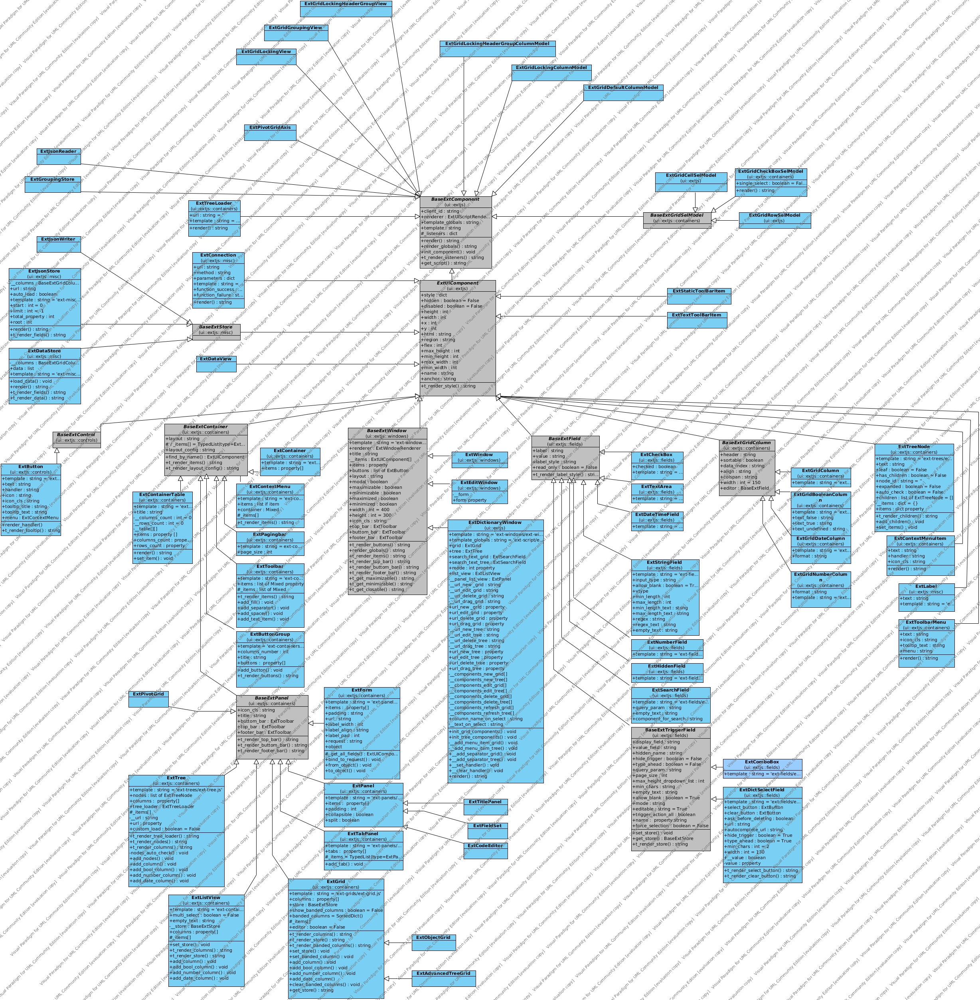

.. _ui:

Подсистема графических компонентов - ui
================================================

===========
Предисловие
===========

Контролы представляют собой в большей степени реализацию extjs контролов, 
а так же имеются и свои наработки (см. ObjectGrid).
Каждый визуальный класс, который может отоброзиться в браузере имеет метод render. 
Этот метод регламентирует правило показа
элемента в браузере. Сложные контролы имеют шаблоны (см. ui.ext.templates), 
в которых описаны правила рендеринга. Исторически
все контролы подрозумевали шаблоны, но в силу медленности шаблонизатора django 
было принято писать рендеринг внутри метода render, а сложные части выносить в 
отдельные статические js файлы (см. m3/static/m3/js)

=============================
Иерархия классов наследования
=============================

Описание свойств и методов в диаграмме visual paradigm (см. m3/uml/m3-ui-ext.vpp)

================
Описание классов
================

* :doc:`ui/BaseExtComponent`
    * :doc:`ui/ExtUIComponent` 
        * :doc:`ui/BaseExtControl`   
            * :doc:`ui/ExtButton`
        * :doc:`ui/BaseExtContainer`
            * :doc:`ui/ExtContainer`
      	    * :doc:`ui/ExtContainerTable`
      	    * :doc:`ui/ExtContextMenu`
      	    * :doc:`ui/ExtPagingBar`
      	    * :doc:`ui/ExtToolBar`
      	    * :doc:`ui/ExtButtonGroup`
      	    * :doc:`ui/BaseExtPanel`
		  	    * :doc:`ui/ExtForm`
		  	    * :doc:`ui/ExtPanel`
		  	    * :doc:`ui/ExtTree`
		  	    * :doc:`ui/ExtTabPanel`
		  	    * :doc:`ui/ExtGrid`
		  	    * :doc:`ui/ExtListView`
        * :doc:`ui/BaseExtWindow`
     	    * :doc:`ui/ExtWindow`
     	    * :doc:`ui/ExtEditWindow`
     	    * :doc:`ui/ExtDictionaryWindow`
     	* :doc:`ui/BaseExtField`
     	    * :doc:`ui/ExtCheckBox`
     	    * :doc:`ui/ExtTextArea`
     	    * :doc:`ui/ExtDateField`
     	    * :doc:`ui/ExtStringField`
     	    * :doc:`ui/ExtNumberField`
     	    * :doc:`ui/ExtHiddenField`
     	    * :doc:`ui/ExtSearchField`
     	    * :doc:`ui/BaseExtTriggerField`
     		    * :doc:`ui/ExtComboBox`
     		    * :doc:`ui/ExtDictSelectField`
        * :doc:`ui/BaseExtGridColumn`
     	    * :doc:`ui/ExtGridColumn`
     	    * :doc:`ui/ExtGridBooleanColumn`
     	    * :doc:`ui/ExtGridDateColumn`
     	    * :doc:`ui/ExtGridNumberColumn`
    * :doc:`ui/ExtTreeNode`
    * :doc:`ui/ExtContextMenuItem`
    * :doc:`ui/ExtLabel`
    * :doc:`ui/ExtToolBarMenu`
    * :doc:`ui/BaseExtGridSelModel`
    	* :doc:`ui/ExtGridCheckBoxSelModel`
     	* :doc:`ui/ExtGridRowSelModel`
     	* :doc:`ui/ExtGridCellSelModel`
    * :doc:`ui/ExtTreeLoader`
    * :doc:`ui/ExtConnection`
    * :doc:`ui/BaseExtStore`
        * :doc:`ui/ExtJsonStore`
        * :doc:`ui/ExtDataStore`
  
