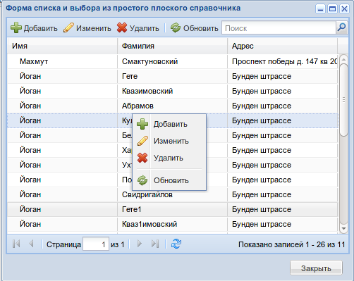
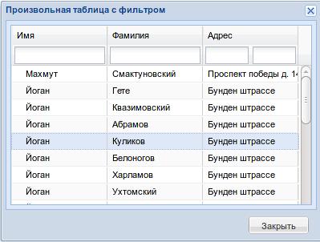

.. _ui:

================================================
Подсистема графических компонентов - ui
================================================

Предисловие
===========

Контролы представляют собой в большей степени реализацию extjs контролов, 
а так же имеются и свои наработки (см. ``ExtObjectGrid``, ``ExtDictSelectField``, ``ExtDictionaryWindow``, etc.).
Каждый визуальный класс, который может отоброзиться в браузере имеет метод ``render``, 
то есть контрол через этот метод преобразуется в js-код. 
Сложные контролы имеют шаблоны (см. ui.ext.templates), 
в которых описаны правила рендеринга. Исторически
все контролы подрозумевали шаблоны, но в силу медленности шаблонизатора django 
было принято писать рендеринг внутри метода render, а сложные части выносить в 
отдельные статические js файлы (см. m3/static/m3/js)

На клиент (браузер)
приходит чистый js-код, состоящий из extjs компонент, который передается как параметр в js функцию ``eval``.

Иерархия классов наследования
=============================

.. image:: _static/extjs-overview.jpg
	:scale: 30 %

Описание свойств и методов в диаграмме visual paradigm (см. m3/uml/m3-ui-ext.vpp)

Примеры использования
=====================

Всяческие реализации контролов вы можете найти в проекте `m3_rnd: <https://repos.med.bars-open.ru/m3-rnd/>`_

Форма выбора из справочника:

Реализация этой формы::

	def dictionary_window(request):
	    window = ExtDictionaryWindow(title = u'Форма списка и выбора из \
	    	простого плоского справочника', mode=0)
	    window.init_grid_components()
	    window.width = 500
	    window.height = 400
	    window.maximizable = True
	    window.grid.add_column(header=u'Имя', data_index = 'fname')
	    window.grid.add_column(header=u'Фамилия', data_index = 'lname')
	    window.grid.add_column(header=u'Адрес', data_index = 'adress')
	    window.grid.set_store(ExtJsonStore(url='/ui/grid-json-store-data', 
	                                       auto_load=True, total_property='total', root='rows'))
	    
	    window.url_new_grid = '/ui/simple-window3'
	    window.url_edit_grid = '/ui/simple-window3'
	    window.url_delete_grid = '/ui/simple-window3'
	    
	    window.grid.bottom_bar = ExtPagingBar()
	
	    return http.HttpResponse(window.get_script())

Произвольная таблица с фильтрами:

Реализация таблицы с фильтрами::
	
	def column_filter_grid(request):
	    '''
	    Пример таблицы с фильтром
	    '''
	    window = ExtEditWindow(title = u'Произвольная таблица c фильтром', layout = 'fit')
	
	    button = ExtButton(text = u'Закрыть')
	    button.handler = 'function(){Ext.getCmp("%s").close();}' % window.client_id
	    window.buttons.append(button)
	
	    grid = ExtGrid()
	    grid.columns.append(ExtGridColumn(header = u'Имя', data_index = 'fname'))
	    grid.columns.append(ExtGridColumn(header = u'Фамилия', data_index = 'lname'))
	    grid.add_column(header=u'Адрес', data_index = 'adress')
	    grid.set_store(ExtJsonStore(url='/ui/grid-json-store-data', auto_load=True, 
	    	total_property='total', root='rows'))
	
	    for col in grid.columns:
	        if col.data_index == 'fname':
	            col.extra['filter'] = u'{xtype:"textfield", tooltip:"Имя", filterName:"fname"}'
	        if col.data_index == 'lname':
	            col.extra['filter'] = u'{xtype:"textfield", tooltip:"Фамилия", filterName:"lname"}'
	        if col.data_index == 'adress':
	            col.extra['filter'] = u'[{xtype:"textfield", tooltip:"Улица",  \
	            	filterName:"street"},{xtype:"textfield", tooltip:"Дом", filterName:"house"}]'
	    grid.plugins.append('new Ext.ux.grid.GridHeaderFilters()')
	    window.form = grid
	
	    return http.HttpResponse(window.get_script())

Описание классов
================

* :doc:`ui/BaseExtComponent`
    * :doc:`ui/ExtUIComponent` 
        * :doc:`ui/BaseExtControl`   
            * :doc:`ui/ExtButton`
        * :doc:`ui/BaseExtContainer`
            * :doc:`ui/ExtContainer`
      	    * :doc:`ui/ExtContainerTable`
      	    * :doc:`ui/ExtContextMenu`
      	    * :doc:`ui/ExtPagingBar`
      	    * :doc:`ui/ExtToolBar`
      	    * :doc:`ui/ExtButtonGroup`
      	    * :doc:`ui/BaseExtPanel`
		  	    * :doc:`ui/ExtForm`
		  	    * :doc:`ui/ExtPanel`
		  	    * :doc:`ui/ExtTree`
		  	    * :doc:`ui/ExtTabPanel`
		  	    * :doc:`ui/ExtGrid`
		  	    * :doc:`ui/ExtListView`
        * :doc:`ui/BaseExtWindow`
     	    * :doc:`ui/ExtWindow`
     	    * :doc:`ui/ExtEditWindow`
     	    * :doc:`ui/ExtDictionaryWindow`
     	* :doc:`ui/BaseExtField`
     	    * :doc:`ui/ExtCheckBox`
     	    * :doc:`ui/ExtTextArea`
     	    * :doc:`ui/ExtDateField`
     	    * :doc:`ui/ExtStringField`
     	    * :doc:`ui/ExtNumberField`
     	    * :doc:`ui/ExtHiddenField`
     	    * :doc:`ui/ExtSearchField`
     	    * :doc:`ui/BaseExtTriggerField`
     		    * :doc:`ui/ExtComboBox`
     		    * :doc:`ui/ExtDictSelectField`
        * :doc:`ui/BaseExtGridColumn`
     	    * :doc:`ui/ExtGridColumn`
     	    * :doc:`ui/ExtGridBooleanColumn`
     	    * :doc:`ui/ExtGridDateColumn`
     	    * :doc:`ui/ExtGridNumberColumn`
    * :doc:`ui/ExtTreeNode`
    * :doc:`ui/ExtContextMenuItem`
    * :doc:`ui/ExtLabel`
    * :doc:`ui/ExtToolBarMenu`
    * :doc:`ui/BaseExtGridSelModel`
    	* :doc:`ui/ExtGridCheckBoxSelModel`
     	* :doc:`ui/ExtGridRowSelModel`
     	* :doc:`ui/ExtGridCellSelModel`
    * :doc:`ui/ExtTreeLoader`
    * :doc:`ui/ExtConnection`
    * :doc:`ui/BaseExtStore`
        * :doc:`ui/ExtJsonStore`
        * :doc:`ui/ExtDataStore`
  
